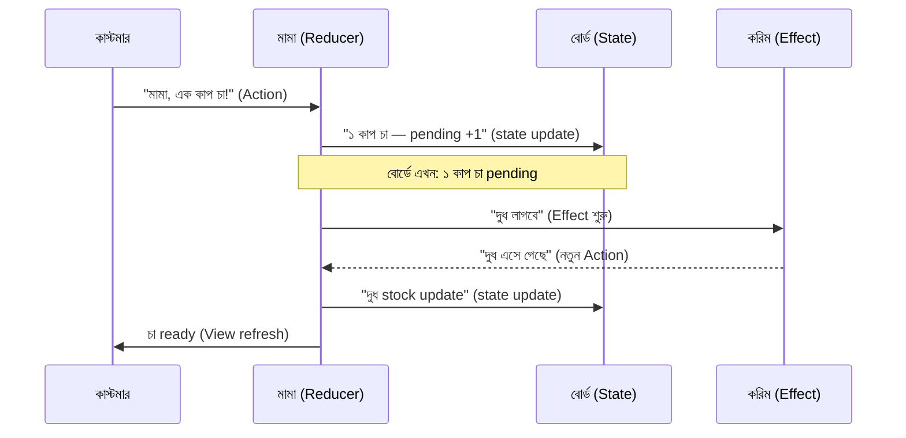

import Callout from '../../components/Callout.astro';
import TeaStallScene from '../../components/TeaStallScene.astro';
import TryIt from '../../components/TryIt.astro';

কোডে যাওয়ার আগে চলো একবার চা স্টলে যাই। মাথায় গেঁথে নাও দৃশ্যটা — পরের অধ্যায়গুলোতে যতবার TCA-র কোনো নতুন শব্দ শুনবে, আমরা চা স্টলে ফিরে আসবো।

## দৃশ্যটা কল্পনা করো

ঢাকার একটা ব্যস্ত মোড়। ফুটপাতের কোণায় একটা ছোট্ট চা স্টল। টিনের চাল, কাঠের counter, কাচের একটা ছোট display যেখানে বিস্কুট আর সিঙ্গাড়া সাজানো। স্টলের নাম-টাম কিছু নেই — সবাই বলে *"মামার স্টল"*।

স্টলে চারজন আছে:

- **মামা** — মাঝবয়সী, সাদা গামছা কাঁধে, মুখে একটা স্থির হাসি। সারাদিন এখানে দাঁড়িয়ে চা বানায়, অর্ডার নেয়, হিসাব রাখে।
- **পেছনের সাদা বোর্ড** — মামার পেছনে দেয়ালে পিন করা। সব pending order, কত কাপ চা কোথায় যাবে, kettle-এ কতটুকু পানি, দুধ কতটুকু বাকি — সব এই বোর্ডে chalk দিয়ে লেখা থাকে।
- **কাস্টমার** — প্রতি মিনিটে কেউ না কেউ আসে। *"মামা, এক কাপ চা!"*, *"মামা, বিল!"*, *"মামা, একটা সিঙ্গাড়া!"*।
- **ছোট ভাই করিম** — পাশের বাজার থেকে দুধ, পানি, চিনি এনে দেয়। মামার নির্দেশে চলে। কখনো ৫ মিনিট লাগে, কখনো ১৫ — কিন্তু ফিরে আসবেই।

<TeaStallScene caption="এই চারজনই সব। বাকি যা কিছু — চা বানানো, অর্ডার serve করা, বিল ক্লিয়ার করা — সব এই চার চরিত্রের interaction দিয়ে চলে।" />

## নিয়মগুলো এক নজরে

স্টলে কিছু **কঠিন নিয়ম** আছে। মামা এগুলো কখনো ভাঙে না —

### ১. বোর্ডে লেখার অধিকার শুধু মামার

কাস্টমার নিজে বোর্ডের সামনে গিয়ে চা-র সংখ্যা বাড়িয়ে দিতে পারে না। ছোট ভাই করিমও পারে না। **শুধু মামা**।

কেউ চা চাইলে মামাকেই বলতে হবে। মামা শুনবে, তারপর বোর্ডে লিখবে। এক জায়গায় সব state — এক জনের হাতে।

> মূল কথা: state change করার ক্ষমতা **এক জনের কাছে**। বাকি সবাই *"মামা, এই কাজটা করো"* বলে message পাঠাতে পারে — কিন্তু নিজে গিয়ে বোর্ডে chalk চালাতে পারে না।

### ২. বোর্ড-ই একমাত্র সত্য

স্টলে দ্বিতীয় কোনো হিসাবের জায়গা নেই। কাস্টমার নিজে মনে রাখে না *"আমার ৩ কাপ baki আছে"* — সে মামার বোর্ড দেখে। মামাও স্মৃতি দিয়ে কাজ করে না — বোর্ড দেখে।

বোর্ডে যা লেখা — সেটাই সত্য। বাকি সব ভুল।

### ৩. কাস্টমার শুধু দেখে আর বলে

কাস্টমার কাচের counter-এর ওপাশে দাঁড়িয়ে বোর্ড দেখে, চা পায়। সে নিজে kettle-এ পানি ঢালে না, নিজে চা বানায় না। *"মামা, এক কাপ চা!"* — এই অর্ডার পাঠানোই তার কাজ।

### ৪. বাইরের কাজ ছোট ভাইয়ের

দুধ শেষ হয়ে গেলে মামা নিজে বাজারে যায় না — তাহলে তো স্টল বন্ধ হয়ে যাবে! সে করিমকে পাঠায়: *"করিম, এক লিটার দুধ আন।"* করিম দৌড়ে যায়, বাজার করে, ফিরে এসে মামাকে বলে: *"মামা, দুধ এসে গেছে।"* তখন মামা সেটা শুনে আবার বোর্ডে লেখে।

মামা bonjour-blocking নাই — দুধ আসা পর্যন্ত স্টল চলতে থাকে। অন্য কাস্টমার এসে গেলে তাদেরও order নেয়।

## এই চারজনের নাম TCA-তে কী

এতক্ষণ যে চারজনকে চিনলে — TCA-তে এদের নিজস্ব নাম আছে:

| চা স্টলে | TCA-তে | কাজ |
|---|---|---|
| পেছনের সাদা বোর্ড | **State** | সব তথ্য এক জায়গায়। |
| কাস্টমারের অর্ডার | **Action** | কী হতে পারে — সব সম্ভাব্য কাজের নাম। |
| মামা | **Reducer** | একমাত্র যে State change করতে পারে। |
| পুরো স্টল (বোর্ড+মামা+system) | **Store** | এই সব মিলিয়ে এক unit। |
| ছোট ভাই করিম | **Effect** | বাইরের async কাজ। |
| কাচের counter | **View** | যেখানে কাস্টমার দেখে আর order পাঠায়। |

পাঁচটা নাম। ৫ বন্ধু। এদেরকেই আমরা সারা site জুড়ে চিনবো।

<Callout type="remember">
এই অধ্যায়ের একটাই কাজ — চা স্টলের দৃশ্যটা মাথায় গাঁথা। পরের অধ্যায়ে এই ৫ বন্ধুর সাথে আলাদা আলাদা পরিচয় হবে। কিন্তু dramatic personae এই অধ্যায়েই introduce হয়ে গেছে।
</Callout>

## একটা ছোট flow — দেখো কেমন চলে

কাস্টমার এসে বলল *"মামা, এক কাপ চা!"*। এর পরে কী হয়, ধাপে ধাপে দেখো —

দেখো — কোথাও দুই দিকের তীর নেই। সব এক দিকে যাচ্ছে। কাস্টমার → মামা → বোর্ড। বোর্ড নিজে থেকে কাস্টমারকে কিছু জিজ্ঞেস করছে না। মামা ছাড়া কেউ বোর্ডে হাত দিচ্ছে না। ছোট ভাই কাজ শেষে আবার মামাকেই বলছে — সরাসরি বোর্ড আপডেট করছে না।

এটাকেই TCA-তে বলে **unidirectional data flow** — একমুখী প্রবাহ। MVVM-এ এটা ছিল না, OOP-তে এটা ছিল না। কিন্তু এটাই TCA-র সবচেয়ে গুরুত্বপূর্ণ rule।

## কেন এই rule-গুলো লাগে?

তুমি ভাবছ — *"স্টলে এতো কড়াকড়ি কেন? দুই-তিন জন মিলে বোর্ডে লিখলে কী হয়?"*

ভাবো একবার। যদি দুই জন মামা থাকে — দুজনেই একই বোর্ডে chalk চালায় — তাহলে কী হবে? একজন লিখছে *"১ কাপ চা"*, অন্যজন একই সময়ে লিখছে *"২ কাপ চা"*। কে কখন কোনটা লিখলো — কেউ বলতে পারবে না। বোর্ডের state inconsistent হয়ে যাবে।

কাস্টমার যদি নিজেই বোর্ডে হাত দিতে পারে — তাহলে এক কাস্টমার চা-র অর্ডার বাড়িয়ে দিল, আরেকজন কমিয়ে দিল, মামা টের পেল না — চা বানানোর হিসাব মিলবে না।

এই সব *বাজে scenario*-গুলো MVVM apps-এ আমরা দেখি, কিন্তু নাম দিই না। *"Cart-এ count mismatch"*, *"Race condition"*, *"State stale"* — এই গুলো সব এই rule না থাকার ফল।

TCA এসে বলে: *"চলো নিয়ম বানিয়ে নিই — এক জায়গায় state, এক জন update করবে, বাইরের কাজ আলাদা চ্যানেলে।"* ব্যস, ৭০% সমস্যা ওখানেই শেষ।

## এই অধ্যায়ের সারমর্ম

<Callout type="remember">
- চা স্টল = TCA-র একটা feature।
- বোর্ড = State। মামা = Reducer। অর্ডার = Action। ছোট ভাই = Effect। কাচের counter = View।
- বোর্ডে শুধু মামা লেখে — state শুধু reducer change করে।
- কেউ direct বোর্ডে হাত দেয় না — সবাই মামাকে message পাঠায়।
- বাইরের কাজ মামা নিজে করে না — ছোট ভাইকে পাঠায়।
- পুরো প্রবাহ এক দিকে — **unidirectional**।
</Callout>

পরের অধ্যায়ে আমরা দেখবো — MVVM-এ এই rule-গুলো কেন follow করা কঠিন, আর TCA এসে কীভাবে এগুলো force করে। দু'টোকে পাশাপাশি দাঁড় করিয়ে দেখলে পার্থক্যটা চোখে পড়বে।
