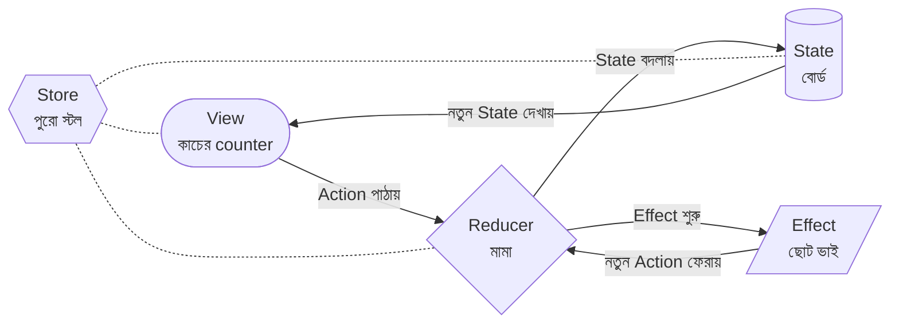
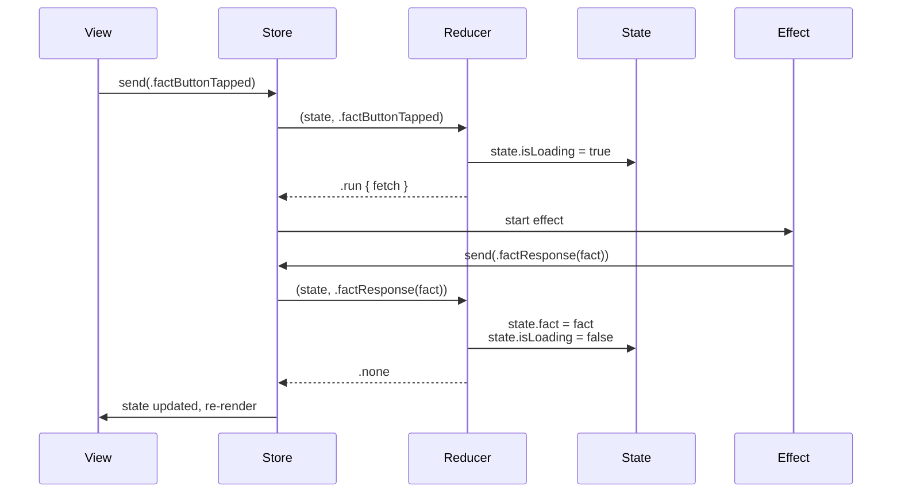

import Callout from '../../components/Callout.astro';
import TeaStallScene from '../../components/TeaStallScene.astro';
import TryIt from '../../components/TryIt.astro';

৫ বন্ধু। এদের প্রত্যেককে আলাদা করে চিনলে, TCA-র যেকোনো code পড়লে তুমি বলতে পারবে *"আচ্ছা, এটা State, ওটা Action, ওইখানে Effect…"*। মুখস্থ না, পরিচয়।



এই গোল চক্রটাই **unidirectional flow**। চলো প্রতিটাকে ধরে ধরে দেখি।

## ১. State, বোর্ড

State মানে তোমার feature-এর সব data। তথ্য। কী কী জানতে হবে, সব এখানে।

চা স্টলে বোর্ডে যা লেখা থাকে, তিন কাপ চা pending, kettle গরম, দুধ ১/২ লিটার, ক্যাশে ২৮০ টাকা, এই সব state।

Swift-এ State হয় **struct**। সাধারণত `Equatable`, যাতে SwiftUI জানে কখন re-render করতে হবে।

```swift
@ObservableState
struct State: Equatable {
    var count = 0
    var fact: String? = nil
    var isLoading = false
}
```

লক্ষ্য করো:

- `var` দিয়ে declare, কারণ Reducer এটাকে mutate করবে।
- Default values দেওয়া, যাতে `State()` লিখলেই initial state পাও।
- `@ObservableState` macro, এটা SwiftUI-কে বলে: *"এই struct-এর কোন property change হচ্ছে, সেটা track করো।"* এই macro-র জন্যই TCA-র view code এতো clean, `WithViewStore` লাগে না।

<Callout type="tip" title="মনে রাখো">
State-এ কোনো method থাকে না, কোনো logic থাকে না। শুধু data। চা স্টলের বোর্ড chalk দিয়ে লেখা একটা list, সেখানে for-loop চলে না, function থাকে না। শুধু লেখা থাকে।
</Callout>

## ২. Action, অর্ডার

Action মানে, তোমার feature-এ যা যা হতে পারে, তার সম্পূর্ণ তালিকা। প্রতিটা সম্ভাব্য *event*-এর একটা নাম।

চা স্টলে কাস্টমার কী কী বলতে পারে? *"এক কাপ চা!"*, *"বিল!"*, *"একটা সিঙ্গাড়া!"*, *"কত হল?"*। ছোট ভাই কী বলতে পারে? *"দুধ এসে গেছে!"*, *"বাজারে দুধ নেই!"*।

Swift-এ Action হয় **enum**। এক enum case = এক ধরনের event।

```swift
enum Action {
    case incrementTapped              // user + button-এ tap করেছে
    case decrementTapped              // user − button-এ tap করেছে
    case factButtonTapped             // user "fact" button-এ tap করেছে
    case factResponse(String)         // API থেকে fact এসেছে
    case factFailed(Error)            // API call fail হয়েছে
}
```

Conventions:

- **User-action-এর জন্য** past tense form: `incrementTapped`, `submitButtonPressed`, `textChanged`। মানে *"user এটা করেছে"*।
- **API response-এর জন্য** `XxxResponse` বা `XxxResult`: `factResponse`, `loginResponse`। মানে *"বাইরের জগৎ এটা ফেরত দিয়েছে"*।
- Associated values use করো যেখানে data বহন করতে হবে: `factResponse(String)`, fact-টা ভেতরে।

<Callout type="warn" title="Action ≠ Function">
Action একটা *event-এর description*, কী হয়েছে। এটা যেন function call না হয়। `case loadFact` (verb form) লেখা যায়, কিন্তু `case factButtonTapped` (event form) বেশি readable। তুমি command দিচ্ছ না, তুমি বলছ *"user এটা করেছে, এখন তুমি (Reducer) ঠিক করো কী হবে।"*
</Callout>

## ৩. Reducer, মামা

এতক্ষণে যে দুটো (State আর Action) দেখলে, এদের মাঝে যে decision-making হয়, সেটাই Reducer।

Reducer-এর কাজ এক কথায়, *"State আর Action দাও, আমি বলবো নতুন State কী, আর কোনো বাইরের কাজ (Effect) দরকার আছে কি না।"*

Mathematically: **(State, Action) → (State, Effect?)**

Code-এ:

```swift
@Reducer
struct CounterFeature {
    @ObservableState
    struct State: Equatable { var count = 0 }

    enum Action {
        case incrementTapped
        case decrementTapped
    }

    var body: some ReducerOf<Self> {
        Reduce { state, action in
            switch action {
            case .incrementTapped:
                state.count += 1   // state বদলালো
                return .none       // বাইরের কাজ নেই

            case .decrementTapped:
                state.count -= 1
                return .none
            }
        }
    }
}
```

দেখো, `Reduce { state, action in ... }` block-টাই মামা। এর ভেতরে `state` mutable, তুমি যা চাও বদলাতে পারো। শেষে কী ফেরাবে? `.none` যদি কোনো বাইরের কাজ না থাকে, বা `.run { ... }` যদি API call জাতীয় কিছু দরকার।

### একটা rule, Reducer pure থাকতে হবে

মামা বোর্ডে chalk চালায়, ব্যস। সে নিজে বাজারে যায় না, নিজে phone-এ কাউকে call করে না। এই sense-এ Reducer **pure**:

- `state.count = 1`, ✓ allowed
- `URLSession.shared.data(...)` সরাসরি call, ✗ not allowed
- `print("debug")`, ✓ ok (debugging-এর জন্য, কিন্তু production-এ অভ্যাস না)
- Random number generate, ✗ technically impure, dependency দিয়ে আনতে হবে
- Date.now use, ✗ same, dependency দিয়ে আনতে হবে

কারণ, মামা যদি **deterministic** না হয় (একই অর্ডার দু'বার দিলে একই কাজ না করে), তাহলে test করা impossible। আমরা ০৯-এ দেখবো, এই pure থাকার কারণেই TestStore এতো জাদু।

## ৪. Store, পুরো চা স্টল

State আর Reducer আলাদা জিনিস। কিন্তু এদেরকে চালাতে গেলে একটা **container** লাগে, যে কথা মনে রাখবে current state কী, কে action পাঠাচ্ছে, কোন effect চলছে। সেই container-ই **Store**।

চা স্টলে, শুধু বোর্ড থাকলে চলবে না, মামাও থাকলে চলবে না। দুটো **একসাথে**, একটা physical স্টল-এ। সেই স্টল-টাই Store।

```swift
let store = Store(initialState: CounterFeature.State()) {
    CounterFeature()
}
```

দুটো জিনিস দিচ্ছ:

১। **`initialState`**, শুরুতে state কী হবে।
২। **A reducer instance**, `CounterFeature()`।

Store তারপর যা করে:

- কেউ `store.send(.incrementTapped)` করলে, Reducer কে state আর action দিয়ে call করে।
- নতুন state ফিরে এলে, internal state replace করে।
- Effect ফিরে এলে, সেটা run করায়, যা যা action আসে সব এই Store-এই process হয়।
- SwiftUI-কে notify করে, *"State বদলেছে, view আপডেট করো।"*

মামা + বোর্ড + অর্ডার নেওয়ার system, পুরোটা মিলিয়ে এক Store।

## ৫. Effect, ছোট ভাই করিম

Reducer pure, মামা শুধু বোর্ডে chalk চালায়। কিন্তু real apps-এ তো API call লাগে, timer চালাতে হয়, file save করতে হয়। এগুলো হবে কোথায়?

উত্তর: **Effect**-এ। Reducer-এর শেষে তুমি `.run { ... }` ফেরাতে পারো, যেটা একটা *আলাদা* কাজ describe করে, async। Store সেটা শুরু করে দেয়, পরে result আসলে নতুন Action হিসেবে আবার Reducer-এ ঢুকে।

```swift
case .factButtonTapped:
    state.isLoading = true
    return .run { [count = state.count] send in
        // এই block-টাই Effect, async, বাইরের জগৎ।
        let fact = try await numberFact.fetch(count)
        await send(.factResponse(fact))
        // ↑ নতুন একটা action ফেরত পাঠানো।
    }

case let .factResponse(fact):
    state.isLoading = false
    state.fact = fact
    return .none
```

দেখো এর ৩টা ধাপ:

১। User button-এ tap করল → `factButtonTapped` action এলো। Reducer state-এ `isLoading = true` করল, তারপর `.run { ... }` Effect ফেরাল।
২। `.run` block-টা চলল, `numberFact.fetch(count)` await করল। result পেলে `send(.factResponse(fact))` দিয়ে আবার একটা action পাঠাল।
৩। Reducer আবার চালু হল, এবার `factResponse` case। `isLoading = false`, `fact = ...`। ব্যস।

প্রতিটা ধাপ Reducer-এই decision, কিন্তু async কাজ আলাদা Effect-এ।

### Effect-এর কিছু variant

- `.none`, কোনো effect নেই।
- `.run { send in ... }`, most common, async block।
- `.send(.someAction)`, সরাসরি আরেকটা action trigger।
- `.merge(...)`, একসাথে একাধিক effect।
- `.concatenate(...)`, sequence-এ একের পর এক।
- `.cancellable(id: ...)`, পরে cancel করার সুযোগ রেখে।

এগুলো আমরা পরের অধ্যায়গুলোয় দেখবো ধাপে ধাপে।

<Callout type="tea-stall">
ছোট ভাই করিম নাম জানা একজন। মামা চিৎকার করে *"করিম!"* বললে সে দৌড়ে আসে। Cancellable effect ঠিক তাই, তুমি একটা *id* দিয়ে effect শুরু করো (নাম দিচ্ছ), পরে দরকার পড়লে সেই id দিয়ে cancel করতে পারো। যেমন: কাস্টমার চলে গেছে, *"করিম, ফিরে আয়! দুধ আনতে হবে না!"*
</Callout>

## পুরো cycle এক জায়গায়



এই sequence-টা TCA-র সব app-এ চলে। MVVM-এ এই flow তোমাকে নিজে maintain করতে হতো, `Task { }`, `[weak self]`, `combineLatest` দিয়ে। TCA-তে structure already-ই এই pattern force করে।

## ছোট্ট quiz, মাথায় গাঁথা হয়েছে কিনা দেখো

<TryIt title="৫ মিনিটের quiz">
নিচের ৪টা scenario পড়ো। প্রতিটায় বলো, এটা State, Action, Reducer, Store, না Effect?

১। *"User screen-এ tap করেছে"*, কোনটা?
২। *"App-এ এখন user logged in কিনা"*, কোনটা?
৩। *"`/api/cart` endpoint-এ POST request"*, কোনটা?
৪। *"`cart.items.count += 1`"*, এই লাইনটা কোথায় চলবে?

<details>
<summary>উত্তর দেখো</summary>

১। **Action**, user যা করেছে, সেটা একটা event।
২। **State**, একটা data (`var isLoggedIn: Bool`)।
৩। **Effect**, বাইরের জগতে কাজ।
৪। **Reducer-এর ভেতরে**, কারণ শুধু সেখানেই state mutate করা যায়।

ভুল হলে চিন্তা নেই, চা স্টলে ফিরে গিয়ে আবার দেখো *এই ঘটনাটা চা স্টলের কোন চরিত্রের সাথে মিলে*। সেটাই উত্তর।
</details>
</TryIt>

## এই অধ্যায়ের সারমর্ম

<Callout type="remember">
- **State** = data। বোর্ড। struct, Equatable, `@ObservableState`।
- **Action** = কী হতে পারে তার তালিকা। enum, exhaustive।
- **Reducer** = মামা। `(state, action) → (state, effect)`। pure।
- **Store** = container। state + reducer একসাথে থাকে।
- **Effect** = বাইরের কাজ। `.run { ... }`, async, শেষে নতুন Action পাঠায়।
- পুরো flow এক দিকে, unidirectional।
</Callout>

PART ১ শেষ। গল্প বলা হয়ে গেল। এবার hand-on। পরের অধ্যায়ে আমরা Xcode খুলবো, আর প্রথম Counter app বানাবো, উপরে যেটা দেখেছ, ঠিক সেটাই, কিন্তু ধাপে ধাপে।
