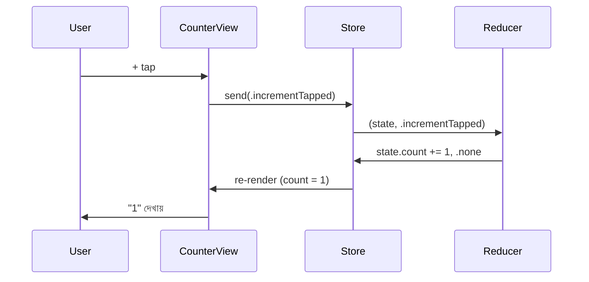

import Callout from '../../components/Callout.astro';
import TeaStallScene from '../../components/TeaStallScene.astro';
import MvvmVsTca from '../../components/MvvmVsTca.astro';
import TryIt from '../../components/TryIt.astro';

<Callout type="tip" title="কোথায় code লিখবে">
চলো `TCAPlayground/Chapter04_Counter/` folder-এ একটা নতুন Swift file বানাই। File → New → File → Swift File, নাম দাও `CounterFeature.swift`, target হিসেবে `TCAPlayground` select করো।
</Callout>

হাতে কলমে শুরু। কোডটা বড় না — ৪০-৪৫ লাইনের একটা feature। কিন্তু এই app থেকে তুমি ৭০% TCA জিনিস শিখে ফেলবে। বড় feature-এর pattern এই সাবধান সাবধান লিখলে — পরে ১০ গুণ বড় কিছু লিখতেও same pattern।

## লক্ষ্য

একটা screen — মাঝে একটা সংখ্যা (`0` দিয়ে শুরু)। দুটো button: **+** আর **−**। Tap করলে সংখ্যা বদলায়। ব্যস।



এই sequence-টা বার বার চলবে — increment, decrement। Effect এই অধ্যায়ে নাই; পরের অধ্যায়ে নিয়ে আসবো।

## ১. Feature — State + Action + Reducer

`CounterFeature.swift`-এ পুরোটা একসাথে দাও —

```swift
import ComposableArchitecture

// @Reducer macro দিয়ে আমরা TCA-কে বলছি — "এটা একটা feature।"
@Reducer
struct CounterFeature {

    // State — feature-এর সব data এক জায়গায়।
    // @ObservableState SwiftUI-র জন্য — view auto-update হবে।
    @ObservableState
    struct State: Equatable {
        var count = 0
    }

    // Action — কী কী হতে পারে।
    // আপাতত শুধু দুটো user action।
    enum Action {
        case incrementTapped
        case decrementTapped
    }

    // body — আসল logic এখানে।
    // ReducerOf<Self> মানে — এই reducer State আর Action-এ কাজ করে।
    var body: some ReducerOf<Self> {
        Reduce { state, action in
            switch action {

            case .incrementTapped:
                state.count += 1
                return .none      // কোনো বাইরের কাজ নেই।

            case .decrementTapped:
                state.count -= 1
                return .none
            }
        }
    }
}
```

এই ৩০ লাইনে যা যা ঘটল —

- `@Reducer` macro — boilerplate কমিয়ে দেয়। আগে আমাদের `var body` আর কিছু extra type signature লিখতে হতো; এখন macro নিজে সামলায়।
- `State: Equatable` — দরকার। কারণ SwiftUI compare করে দেখে state বদলেছে কিনা।
- `enum Action` — exhaustive। `switch action` এ যদি কোনো case miss করো, Swift compiler পাকড়ে দেবে — এটাই বড় advantage।
- `Reduce { state, action in ... }` — মামা। ভিতরে `state` mutable। সব decision এখানে।
- `.none` — *"বাইরের কাজ নেই, কাজ শেষ"*।

<Callout type="tip" title="@ObservableState কেন">
পুরনো TCA-তে view-তে `WithViewStore { viewStore in ... }` wrapper দিয়ে state দেখতে হতো — দু'বার closure, এক্সট্রা boilerplate। `@ObservableState` macro এসে এই ব্যাপারটা সহজ করে দিয়েছে — এখন view-তে সরাসরি `store.count`, `store.fact` access করা যায়, কোনো wrapper লাগে না। ধন্যবাদ Apple-এর Observation framework-কে — TCA সেটা দারুণভাবে use করেছে।
</Callout>

## ২. View

এবার `CounterView.swift` (same folder-এ) —

```swift
import SwiftUI
import ComposableArchitecture

struct CounterView: View {
    // Store: পুরো স্টল। আমরা শুধু এর handle পাচ্ছি।
    let store: StoreOf<CounterFeature>

    var body: some View {
        VStack(spacing: 30) {
            // State directly access — @ObservableState এর জাদু।
            Text("\(store.count)")
                .font(.system(size: 72, weight: .bold, design: .rounded))
                .monospacedDigit()
                .frame(minWidth: 120)

            HStack(spacing: 20) {
                Button {
                    store.send(.decrementTapped)   // Action পাঠানো।
                } label: {
                    Image(systemName: "minus.circle.fill")
                        .font(.system(size: 44))
                }

                Button {
                    store.send(.incrementTapped)
                } label: {
                    Image(systemName: "plus.circle.fill")
                        .font(.system(size: 44))
                }
            }
        }
        .padding()
        .navigationTitle("Counter")
    }
}
```

লক্ষ্য করো —

- `let store: StoreOf<CounterFeature>` — view শুধু store-এর reference রাখছে। সে নিজে count maintain করছে না।
- `store.count` সরাসরি — `WithViewStore` লাগেনি।
- `store.send(.incrementTapped)` — action পাঠানো। View নিজে কাউন্ট বাড়ায় না, শুধু *"মামাকে message পাঠাল"*।

<MvvmVsTca>
<Fragment slot="mvvm">

```swift
// View
@StateObject var vm = CounterVM()

Text("\(vm.count)")
Button("+") { vm.increment() }
```

View → ViewModel-এর function call করছে। ViewModel-ই state।

</Fragment>
<Fragment slot="tca">

```swift
// View
let store: StoreOf<CounterFeature>

Text("\(store.count)")
Button("+") {
    store.send(.incrementTapped)
}
```

View → Action পাঠাচ্ছে। কোনো method call না। State আলাদা struct-এ।

</Fragment>
</MvvmVsTca>

পার্থক্য সূক্ষ্ম কিন্তু গুরুত্বপূর্ণ। MVVM-এ tap হলে কী হবে সেটা view-ই *জানে* (`increment()` call করতে হবে)। TCA-তে view *জানে না* — সে শুধু বলে *"+ button tapped"*, বাকিটা Reducer-এর সিদ্ধান্ত।

## ৩. App entry — Store বানানো

`TCAPlaygroundApp.swift`-এ এই counter-কে list-এ add করো —

```swift
import SwiftUI
import ComposableArchitecture

@main
struct TCAPlaygroundApp: App {
    var body: some Scene {
        WindowGroup {
            NavigationStack {
                List {
                    Section("Part ২ — হাতে কলমে") {

                        NavigationLink("০৪ — Counter") {
                            // Store এখানেই তৈরি হয় — এক বার, top-level-এ।
                            CounterView(
                                store: Store(
                                    initialState: CounterFeature.State()
                                ) {
                                    CounterFeature()
                                }
                            )
                        }

                    }
                }
                .navigationTitle("TCAPlayground")
            }
        }
    }
}
```

দুটো জিনিস লক্ষ্য করো —

১। **Store top-level-এ তৈরি।** App entry-তে এক বার তৈরি — সারা lifetime একই store ব্যবহার হবে এই feature-এর জন্য। তুমি প্রতি tap-এ নতুন store বানাও না।

২। **Trailing closure দিয়ে Reducer।** `Store(initialState: ...) { CounterFeature() }` — closure-এর ভেতরে reducer instance। এটা TCA-র convention।

⌘R চাপো। চলবে। **+** দু-তিন বার tap করো — সংখ্যা বাড়ছে। **−** চাপো — কমছে।

🎉 প্রথম TCA app চলছে।

<TeaStallScene caption="Counter app-এর scope-এ স্টলের চিত্র — বোর্ডে শুধু একটা সংখ্যা, কাস্টমার দুই ধরনের অর্ডার দিতে পারে, মামা শুধু সংখ্যা বাড়ায়/কমায়। ছোট ভাইয়ের দরকার এখনো হয়নি।" highlight={null} />

## যা শিখেছ এই অধ্যায়ে

- `@Reducer` macro দিয়ে feature-এর skeleton।
- `@ObservableState` দিয়ে SwiftUI-র সাথে seamless integration।
- View শুধু `store.send(...)` করছে, state-এ সরাসরি লেখা যাচ্ছে না।
- Store top-level-এ এক বার তৈরি।

এই pattern বদলায় না। ১০০ feature বানালেও — same skeleton, same flow।

## চা স্টলে যেমন

<Callout type="tea-stall">
এই app-এ মামার কাজ সহজ — কাস্টমার বলল *"+1"*, মামা বোর্ডে এক বাড়িয়ে দিল। বাইরের কেউ লাগেনি — ছোট ভাই বাজার যায়নি, kettle গরম করতে হয়নি। `return .none` মানে *"আমার এই অর্ডার সামলাতে বাইরের কারো দরকার নেই"*।
</Callout>

## নিজে চেষ্টা করো

<TryIt title="৩ টা ছোট পরিবর্তন">
১। একটা **reset** button add করো। Tap করলে count আবার `0`-তে ফিরবে।

হিন্ট: Action-এ একটা নতুন case (`.resetTapped`), Reducer-এ সেটা handle করো (`state.count = 0`), View-এ আরেকটা button।

২। Count কখনো **negative** হতে দেবে না — `decrementTapped` action এলে যদি `state.count == 0` হয়, কিছু করো না।

হিন্ট: `state.count > 0` চেক করো।

৩। Count যখন `10`-এ পৌঁছাবে, button দুটো **disable** হয়ে যাবে। দশের বেশি যাবে না।

হিন্ট: View-এ `.disabled(store.count >= 10)`।

<details>
<summary>উত্তর দেখো</summary>

```swift
// Feature.swift
enum Action {
    case incrementTapped
    case decrementTapped
    case resetTapped         // ১
}

var body: some ReducerOf<Self> {
    Reduce { state, action in
        switch action {

        case .incrementTapped:
            // ৩: 10-এ আটকে দেওয়া
            guard state.count < 10 else { return .none }
            state.count += 1
            return .none

        case .decrementTapped:
            // ২: negative হতে দেবে না
            guard state.count > 0 else { return .none }
            state.count -= 1
            return .none

        case .resetTapped:    // ১
            state.count = 0
            return .none
        }
    }
}

// View.swift
HStack {
    Button { store.send(.decrementTapped) } label: { ... }
        .disabled(store.count == 0)            // ৩

    Button { store.send(.resetTapped) } label: {
        Image(systemName: "arrow.counterclockwise.circle.fill")
            .font(.system(size: 44))
    }

    Button { store.send(.incrementTapped) } label: { ... }
        .disabled(store.count >= 10)           // ৩
}
```

</details>
</TryIt>

## এই অধ্যায়ের সারমর্ম

<Callout type="remember">
- Feature = State + Action + Reducer একসাথে এক struct-এ।
- `@Reducer` আর `@ObservableState` macro বুদ্ধিমান বানিয়ে দেয়।
- View শুধু store handle করে আর action পাঠায়।
- Store top-level-এ এক বার তৈরি।
- `.none` মানে কোনো effect নেই।
</Callout>

পরের অধ্যায়ে আমরা ছোট ভাইকে কাজে লাগাবো — API call করে এই কাউন্টের জন্য একটা *fact* এনে দেখাবো।
