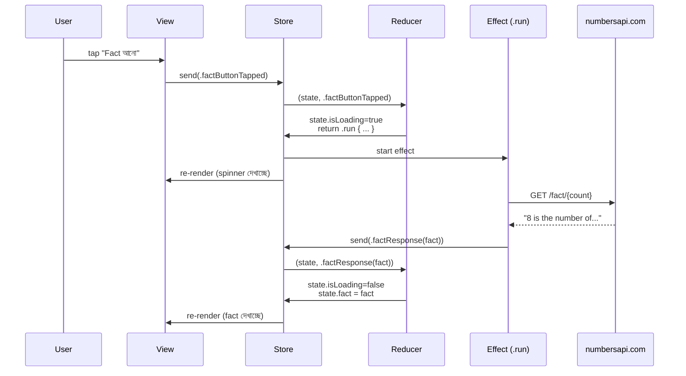

import Callout from '../../components/Callout.astro';
import TeaStallScene from '../../components/TeaStallScene.astro';
import TryIt from '../../components/TryIt.astro';

<Callout type="tip" title="কোথায় code লিখবে">
চলো `TCAPlayground/Chapter05_NumberFact/` folder-এ একটা নতুন Swift file বানাই। File → New → File → Swift File, নাম `NumberFactFeature.swift`।
</Callout>

আগের counter-এ মামা একাই সব করেছে — কাউকে বাজারে পাঠাতে হয়নি। কিন্তু real apps-এ API call ছাড়া কিছুই হয় না। এই অধ্যায়ে ছোট ভাই করিম কাজে নামবে।

## আজকের লক্ষ্য

Counter app-এর সাথে একটা **"Fact আনো"** button থাকবে। Tap করলে — বর্তমান count-টার একটা মজার তথ্য `http://numbersapi.com/{count}` থেকে fetch হবে আর screen-এ দেখাবে।

দু'টো নতুন জিনিস শিখবো এই অধ্যায়ে —

- **`.run` effect** দিয়ে async কাজ।
- **`@Dependency`** দিয়ে API client inject — যাতে test করা যায়।

## ১. আগের State-কে বাড়াও

`NumberFactFeature.swift`-এ পুরো feature নতুন করে লিখবো —

```swift
import ComposableArchitecture
import Foundation

@Reducer
struct NumberFactFeature {

    @ObservableState
    struct State: Equatable {
        var count = 0
        var fact: String? = nil      // API থেকে আসা তথ্য।
        var isLoading = false        // loading indicator দেখাবে কি না।
    }

    enum Action {
        case incrementTapped
        case decrementTapped

        case factButtonTapped        // user fact চাইছে।
        case factResponse(String)    // API থেকে fact এসেছে।
        case factFailed              // API call fail হয়েছে।
    }

    // আপাতত URLSession সরাসরি use করবো — পরের অধ্যায়ে dependency বানাবো।
    var body: some ReducerOf<Self> {
        Reduce { state, action in
            switch action {

            case .incrementTapped:
                state.count += 1
                state.fact = nil     // পুরনো fact মুছে দাও।
                return .none

            case .decrementTapped:
                state.count -= 1
                state.fact = nil
                return .none

            case .factButtonTapped:
                state.isLoading = true
                state.fact = nil
                // ↓ ছোট ভাইকে পাঠালাম।
                return .run { [count = state.count] send in
                    let url = URL(string: "http://numbersapi.com/\(count)")!
                    let (data, _) = try await URLSession.shared.data(from: url)
                    let text = String(data: data, encoding: .utf8) ?? "তথ্য পেলাম না"
                    // ↓ ফিরে এসে নতুন একটা action পাঠাচ্ছে।
                    await send(.factResponse(text))
                }
                catch: { _, send in
                    await send(.factFailed)
                }

            case let .factResponse(text):
                state.isLoading = false
                state.fact = text
                return .none

            case .factFailed:
                state.isLoading = false
                state.fact = "ইন্টারনেট-এ একটু সমস্যা — পরে চেষ্টা করো।"
                return .none
            }
        }
    }
}
```

দেখো — Reducer-এর shape একই: `Reduce { state, action in switch action ... }`. শুধু এক জায়গায় `.none`-এর পরিবর্তে `.run { ... }`।

## `.run` effect-টা কী

`.run { send in ... }` মানে — *"এই async block-টা চালাও। শেষে যদি কোনো নতুন action পাঠাতে চাও, `send(...)` দিয়ে পাঠাও।"*

ভিতরে যা আছে — সব normal `async`/`await` code। `URLSession`, `Task.sleep`, file read — যা চাই।

```swift
return .run { [count = state.count] send in
    let fact = try await fetchFromAPI(count)
    await send(.factResponse(fact))
}
```

কিছু সূক্ষ্ম জিনিস —

### `[count = state.count]` কেন

Closure-এর শুরুতে এই `[count = state.count]` — এটা **value capture**। মুহূর্তে যা `state.count`, সেটাই closure-এর ভেতরে যাবে। কারণ Effect run হওয়ার সময় state হয়তো বদলে গেছে — যদি ততক্ষণে user আরো ৩ বার tap করে।

এটা না দিলেও কাজ হবে অনেক ক্ষেত্রে, কিন্তু `state` সরাসরি access করতে পারবে না effect-এ। **Capture-ই safer।**

### `catch:` block

`.run` ভিতরে throw হলে কী হবে? দ্বিতীয় closure দাও — `catch: { error, send in ... }`। সেখান থেকে আরেকটা action পাঠাতে পারো (failure case)।

না দিলে — TCA console-এ একটা warning print করবে, error ignore হবে। তোমার app crash করবে না, কিন্তু user কিছুই বুঝবে না কী হলো। তাই **catch দাও**।

## ২. View — loading state দেখাও

`NumberFactView.swift` —

```swift
import SwiftUI
import ComposableArchitecture

struct NumberFactView: View {
    let store: StoreOf<NumberFactFeature>

    var body: some View {
        VStack(spacing: 24) {
            Text("\(store.count)")
                .font(.system(size: 64, weight: .bold, design: .rounded))

            HStack(spacing: 16) {
                Button("−") { store.send(.decrementTapped) }
                Button("+") { store.send(.incrementTapped) }
            }
            .buttonStyle(.borderedProminent)
            .font(.title2)

            Button {
                store.send(.factButtonTapped)
            } label: {
                if store.isLoading {
                    ProgressView()
                } else {
                    Label("একটা মজার তথ্য আনো", systemImage: "sparkles")
                }
            }
            .buttonStyle(.bordered)
            .disabled(store.isLoading)

            // fact থাকলে দেখাও।
            if let fact = store.fact {
                Text(fact)
                    .padding()
                    .frame(maxWidth: .infinity, alignment: .leading)
                    .background(.thinMaterial, in: RoundedRectangle(cornerRadius: 12))
            }
        }
        .padding()
        .navigationTitle("Number Fact")
    }
}
```

View-তেও কিছু complexity বাড়লো — `if store.isLoading` দিয়ে spinner, `if let fact = store.fact` দিয়ে result। কিন্তু এ সব data-driven — `store.isLoading` true হলে spinner আসবে, false হলে যাবে। View কোনো `Task`-এর কথা জানে না, কোনো `URLSession`-এর কথা জানে না।

## ৩. App entry-তে যোগ করো

`TCAPlaygroundApp.swift`-এর list-এ একটা NavigationLink যোগ করো —

```swift
NavigationLink("০৫ — Number Fact") {
    NumberFactView(
        store: Store(initialState: NumberFactFeature.State()) {
            NumberFactFeature()
        }
    )
}
```

Run করো। **+** চাপো কয়েকবার। তারপর *"একটা মজার তথ্য আনো"*। ২-৩ সেকেন্ড spinner, তারপর fact। 🍵

## পুরো cycle আবার দেখো



লক্ষ্য করো — তিনবার Reducer চলেছে: একবার `factButtonTapped`-এ, একবার response-এ (`factResponse`), আর যদি error হয় তাহলে `factFailed`-এ। প্রতিবারে state-এর pure mutation, কোনো হিজিবিজি না।

## চা স্টলে যেমন

<Callout type="tea-stall">
এই app-এ ছোট ভাই করিম কাজ করেছে — মামা বলল *"করিম, ৮ নম্বর সম্পর্কে কিছু এনে দে"*, করিম পাশের `numbersapi.com` বাজারে গিয়ে fact এনে মামাকে দিয়ে বলল *"মামা, fact এসে গেছে: ৮-এর ৪টা বাহু থাকে।"*। মামা সেটা শুনে বোর্ডে লিখল।

মামা নিজে কখনো বাজারে যায়নি। `.run` block-এর ভেতরে যা যা ঘটেছে — সব করিমের জগতের কাজ। Reducer pure থেকেছে।
</Callout>

## একটা গুরুত্বপূর্ণ catch — URLSession সরাসরি use করা ভালো না

এই অধ্যায়ের code-এ আমরা `URLSession.shared.data(...)` সরাসরি use করেছি। এটা **কাজ করে**, কিন্তু testing-এর জন্য খারাপ। কেন?

- Test environment-এ network call চালালে test slow হয়।
- Network not always available — CI-তে test fail করবে।
- Real API hit করে test লেখা মানে — API broken হলে তোমার test-ও broken।
- API rate limit-এ পড়ে যেতে পারো।

তাই আসল pattern হলো — `URLSession`-কে একটা *"client"*-এ wrap করো, সেটা feature-এ inject করো। Test-এ fake client দিয়ে replace করো।

এই pattern-এর নাম **Dependency Injection**, আর TCA-তে এটার জন্য আছে `@Dependency` macro। আমরা অধ্যায় ০৮-এ এটাই করবো — `NumberFactClient` বানাবো, `@Dependency(\.numberFact)` দিয়ে inject করবো।

আপাতত URLSession সরাসরি use করছি — কারণ আগে concept বুঝতে হবে, তারপর refactor।

## নিজে চেষ্টা করো

<TryIt title="দু'টো extension">
১। **Auto-fact:** prefix counter-এর প্রতি change-এর সাথে auto fact load হবে। মানে `incrementTapped` হলে count বাড়ার সাথে সাথে fact-এর জন্যও request যাবে।

হিন্ট: `.incrementTapped` case-এ `.run` return করো, যেটা fact fetch করে। কিন্তু সাবধান — দ্রুত দ্রুত tap করলে multiple request যাবে। সেটার সমাধান cancellable effect (অধ্যায় ০৬-এ দেখবো)।

২। **Manual refresh button:** fact-এর পাশে একটা refresh icon button। Tap করলে আবার একই count-এর জন্য fact fetch হবে।

হিন্ট: একটা নতুন action — `case refreshFactTapped`। এটা handle করার সময় `factButtonTapped`-এর মতোই কাজ।

<details>
<summary>প্রথমটার hint</summary>

```swift
case .incrementTapped:
    state.count += 1
    state.fact = nil
    state.isLoading = true
    return .run { [count = state.count] send in
        let url = URL(string: "http://numbersapi.com/\(count)")!
        let (data, _) = try await URLSession.shared.data(from: url)
        let text = String(data: data, encoding: .utf8) ?? ""
        await send(.factResponse(text))
    }
```

কিন্তু দ্রুত tap করলে — race condition। সেটা সামলাতে cancellable effect, যেটা পরের অধ্যায়ে আসছে।
</details>
</TryIt>

## এই অধ্যায়ের সারমর্ম

<Callout type="remember">
- **`.run { send in ... }`** = async effect শুরু। ভিতরে normal `async`/`await`।
- শেষে `await send(.someAction)` — নতুন action পাঠানো।
- `catch: { _, send in ... }` দিয়ে error handle।
- `[count = state.count]` দিয়ে value capture — race condition এড়াতে।
- View নিজে network এর কথা জানে না — শুধু `isLoading`, `fact` দেখায়।
- API client সরাসরি use করা চলে, কিন্তু test-এর জন্য `@Dependency` ভালো (অধ্যায় ০৮)।
</Callout>

পরের অধ্যায়ে আমরা দুটো feature একসাথে compose করবো — Counter + Profile, এক screen-এ, কিন্তু independent। `Scope`-এর সাথে পরিচয়।
