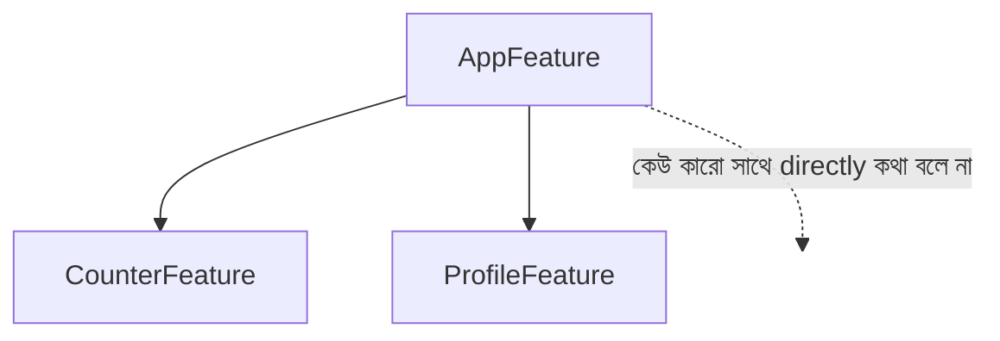
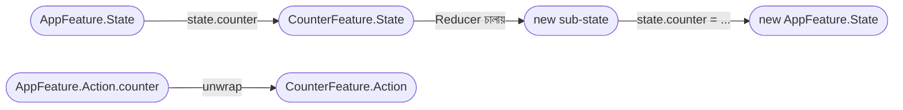

import Callout from '../../components/Callout.astro';
import TeaStallScene from '../../components/TeaStallScene.astro';
import TryIt from '../../components/TryIt.astro';

<Callout type="tip" title="কোথায় code লিখবে">
চলো `TCAPlayground/Chapter06_Composition/` folder-এ তিনটা নতুন file বানাই — `CounterFeature.swift` (আগেরটার একটা সংস্করণ), `ProfileFeature.swift`, আর `AppFeature.swift`। সবগুলো এই folder-এ।
</Callout>

এতক্ষণ আমরা **এক feature** নিয়ে কাজ করেছি। এবার দুটো features একসাথে এক screen-এ দেখাবো। কীভাবে এক বড় feature ভাঙা যায় ছোট ছোট feature-এ — সেটাই **composition**, আর সেটাই TCA-র *"Composable"* শব্দটার অর্থ।

## লক্ষ্য

এক screen-এ দুটো অংশ —

- উপরে একটা **Counter** (counter চিনি, আগের অধ্যায়ের)।
- নিচে একটা ছোট **Profile** — username field, আর একটা *"Save"* button।

দুটো feature **আলাদা** thinking — একটার সাথে অন্যটার connection নেই। কিন্তু এক view-তে show করছি, এবং উভয়েরই state app-level-এ থাকছে।



## ১. CounterFeature — আগেরটাই, একটু সাজানো

```swift
// CounterFeature.swift
import ComposableArchitecture

@Reducer
struct CounterFeature {
    @ObservableState
    struct State: Equatable {
        var count = 0
    }

    enum Action {
        case incrementTapped
        case decrementTapped
    }

    var body: some ReducerOf<Self> {
        Reduce { state, action in
            switch action {
            case .incrementTapped:
                state.count += 1
                return .none
            case .decrementTapped:
                state.count -= 1
                return .none
            }
        }
    }
}
```

কিছু নতুন না। আগের counter-এর exact কপি।

## ২. ProfileFeature — নতুন

```swift
// ProfileFeature.swift
import ComposableArchitecture

@Reducer
struct ProfileFeature {
    @ObservableState
    struct State: Equatable {
        var username: String = ""
        var savedName: String? = nil
    }

    enum Action {
        // BindableAction না, কারণ আমরা manual binding দেখাতে চাই।
        case usernameChanged(String)
        case saveTapped
    }

    var body: some ReducerOf<Self> {
        Reduce { state, action in
            switch action {

            case let .usernameChanged(name):
                state.username = name
                return .none

            case .saveTapped:
                let trimmed = state.username.trimmingCharacters(in: .whitespaces)
                guard !trimmed.isEmpty else { return .none }
                state.savedName = trimmed
                return .none
            }
        }
    }
}
```

দেখো — Counter আর Profile **একে অপরের কথা জানে না**। দুটো আলাদা ফাইল, আলাদা State, আলাদা Action। এটাই isolation।

## ৩. AppFeature — দুটোকে এক জায়গায় আনো

এবার একটা parent reducer বানাবো যেটা দুটোকে compose করবে।

```swift
// AppFeature.swift
import ComposableArchitecture

@Reducer
struct AppFeature {

    // Parent-এর State-এ children-এর state থাকে।
    @ObservableState
    struct State: Equatable {
        var counter = CounterFeature.State()
        var profile = ProfileFeature.State()
    }

    // Parent-এর Action-এ children-এর action wrap থাকে।
    enum Action {
        case counter(CounterFeature.Action)
        case profile(ProfileFeature.Action)
    }

    var body: some ReducerOf<Self> {
        // Scope বলে দেয় — counter action আসলে CounterFeature reducer চালাও।
        Scope(state: \.counter, action: \.counter) {
            CounterFeature()
        }

        // ↓ একই profile-এর জন্য।
        Scope(state: \.profile, action: \.profile) {
            ProfileFeature()
        }

        // Parent-এর নিজস্ব logic এখানে — যদি দরকার হয়।
        // আপাতত কিছু নেই।
        Reduce { state, action in
            return .none
        }
    }
}
```

## `Scope` — সবচেয়ে গুরুত্বপূর্ণ ব্যাপার

`Scope(state: \.counter, action: \.counter) { CounterFeature() }` — এই লাইনটা বুঝলে composition বুঝে গেছ।

`Scope` parent reducer-কে বলে:

> *"যখনই `Action.counter(...)` আসবে, parent state-এর `counter` field-এ focus কর। সেই sub-state-কে `CounterFeature` reducer-এর কাছে পাঠাও। সে যা ফেরাবে — আপডেটেড sub-state — সেটা parent state-এর `counter` field-এ লিখে দাও।"*

`\.counter` দুটো — একটা state keypath, একটা action case keypath। মানে — parent state-এর কোন property, আর parent action-এর কোন case এই child-এর সাথে map করে।



## ৪. View — দুই feature এক screen-এ

```swift
// AppView.swift (Chapter06 folder-এ)
import SwiftUI
import ComposableArchitecture

struct AppView: View {
    let store: StoreOf<AppFeature>

    var body: some View {
        Form {
            Section("Counter") {
                HStack {
                    Button("−") { store.send(.counter(.decrementTapped)) }
                    Spacer()
                    Text("\(store.counter.count)").font(.title.monospacedDigit())
                    Spacer()
                    Button("+") { store.send(.counter(.incrementTapped)) }
                }
                .buttonStyle(.borderless)
            }

            Section("Profile") {
                TextField(
                    "তোমার নাম",
                    text: Binding(
                        get: { store.profile.username },
                        set: { store.send(.profile(.usernameChanged($0))) }
                    )
                )
                Button("Save") {
                    store.send(.profile(.saveTapped))
                }
                if let name = store.profile.savedName {
                    Text("সংরক্ষিত: \(name)")
                        .foregroundStyle(.secondary)
                }
            }
        }
        .navigationTitle("Composition")
    }
}
```

দেখো —

- `store.counter.count` — child state-এ access। Parent store-এর মাধ্যমে।
- `store.send(.counter(.incrementTapped))` — child-এ action পাঠানো। **Wrap করতে হচ্ছে** — কারণ outer action enum-এর `counter(...)` case-এ ভিতরে inner action যাচ্ছে।
- Manual `Binding` — TextField-এর জন্য। পরে আমরা `@Bindable` দিয়ে এটাকে আরো সহজ করতে পারি (BindableAction-এর সাথে)।

<Callout type="tip" title="@Bindable দিয়ে আরো clean করা যায়">
যদি action enum-এ `@CasePathable` আর `BindableAction` use করো — তাহলে `Binding` manual করতে হয় না। View-এ লেখা যায়:

```swift
@Bindable var store: StoreOf<AppFeature>

TextField("Name", text: $store.profile.username)
```

কিন্তু এই অধ্যায়ে manual binding দেখালাম যাতে underneath কী হচ্ছে সেটা বুঝতে পারো। Production-এ অবশ্যই `@Bindable` use করো।
</Callout>

## ৫. App entry-তে যোগ করো

```swift
NavigationLink("০৬ — Composition") {
    AppView(
        store: Store(initialState: AppFeature.State()) {
            AppFeature()
        }
    )
}
```

Run করো। Counter চলবে। Profile-এ নাম লিখে save করলে দেখাবে। দুটো feature আলাদা ভাবে কাজ করছে — কিন্তু এক ছাদের নিচে।

## কেন এই pattern important

ভাবো একবার — তুমি যদি Counter-এ একটা bug পাও। কোথায় খুঁজবে? `CounterFeature.swift`। AppFeature-এ যেতেই হবে না। Profile-এ যেতেই হবে না।

ভাবো — একই Counter feature-টা তুমি অন্য কোনো screen-এও use করতে চাও। কোনো সমস্যা নেই — `CounterFeature()` কোথাও instantiate করো, `Store` বানাও, ব্যস।

ভাবো — Counter team-এ একজন কাজ করছে, Profile team-এ অন্যজন। দুজনের কোডে conflict নেই — কারণ আলাদা ফাইল, আলাদা struct।

এটাই composition-এর শক্তি।

## চা স্টলে যেমন

<Callout type="tea-stall">
ভাবো একটা মামার দুইটা স্টল চালু — চায়ের স্টল আর সিঙ্গাড়ার স্টল। দুটোর নিজস্ব মামা, নিজস্ব বোর্ড, নিজস্ব অর্ডার। কিন্তু *বড় মামা* মাঝে মাঝে এসে দুটো স্টলেই নজর রাখে — দরকার পড়লে এক স্টলের লাভ আরেকটায় transfer করে।

`Scope(state: \.chai, action: \.chai) { ChaiStall() }` মানে — *"বড় মামা, চায়ের স্টলের জন্য তুমি ছোট মামার উপর ভরসা রাখো। শুধু চায়ের অর্ডার এলে, ছোট মামার বোর্ডের ওই অংশটা তাকে দাও, সে যা update করবে সেটা তোমার বড় বোর্ডের ওই অংশে লিখে দিও।"* এটাই Scope।
</Callout>

## নিজে চেষ্টা করো

<TryIt title="তৃতীয় feature যোগ">
এই app-এ একটা তৃতীয় feature যোগ করো — `NotesFeature`। এটার state-এ একটা `notes: [String]` থাকবে, action-এ `case addNoteTapped(String)` আর `case clearTapped`। AppFeature-এ scope করো, View-এ একটা list দেখাও।

হিন্ট:

```swift
// AppFeature.State
var notes = NotesFeature.State()

// AppFeature.Action
case notes(NotesFeature.Action)

// AppFeature.body
Scope(state: \.notes, action: \.notes) {
    NotesFeature()
}
```

প্রথম দু'টা feature ছোঁবে না — শুধু আরেকটা Scope add হবে।
</TryIt>

## এই অধ্যায়ের সারমর্ম

<Callout type="remember">
- Parent feature-এর State-এ child-এর state থাকে।
- Parent feature-এর Action-এ child-এর action `case childName(ChildFeature.Action)` form-এ wrap থাকে।
- `Scope(state: \.child, action: \.child) { ChildFeature() }` দিয়ে parent-এ child-কে connect।
- View-এ `store.child.something`, `store.send(.child(.someAction))`।
- Children একে অপরকে চেনে না — সব communication parent-এর মধ্য দিয়ে।
</Callout>

PART ২ শেষ। তিনটা feature বানিয়েছ — counter, fact, composition। এখন PART ৩-এ আরো গভীরে যাবো — navigation, dependency, testing।
