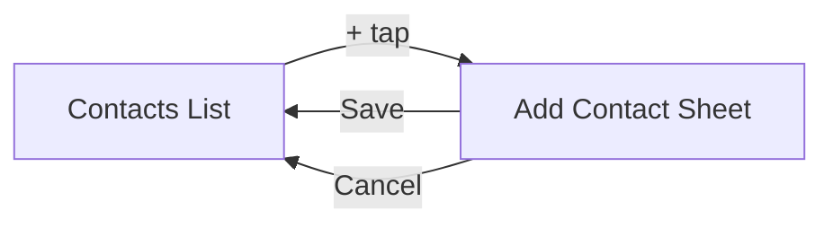

import Callout from '../../components/Callout.astro';
import TryIt from '../../components/TryIt.astro';

<Callout type="tip" title="কোথায় code লিখবে">
চলো `TCAPlayground/Chapter07_Navigation/` folder-এ চারটা file বানাই — `ContactsFeature.swift`, `AddContactFeature.swift`, `ContactsView.swift`, `AddContactView.swift`। সবগুলো এই folder-এ।
</Callout>

Navigation MVVM-এ একটা পেইন। Sheet দেখাতে গেলে `@State var showSheet = false`, push করতে গেলে আবার `NavigationLink`-এর সাথে binding, একসাথে কয়েকটা destination থাকলে enum বানাতে হয়, বা multiple bool flags — সব এলোমেলো হয়ে যায়।

TCA-তে এটা একটা **pattern**-এ বাঁধা — `@Presents` দিয়ে। এক বার শিখলে সব ধরনের navigation এই same pattern-এ চলে।

## আজকের লক্ষ্য

একটা ছোট **Contacts** app —

- প্রথম screen-এ contact-দের list।
- ডান উপরে একটা **+** button — tap করলে sheet আসবে নতুন contact add করার জন্য।
- Sheet-এ name field আর **Save** button। Save-এ list-এ যোগ হবে, sheet বন্ধ হবে।



## ১. AddContactFeature — child feature

`AddContactFeature.swift` —

```swift
import ComposableArchitecture

@Reducer
struct AddContactFeature {

    @ObservableState
    struct State: Equatable {
        var name: String = ""
        // Contact বানানোর সময় id auto-generate হবে।
        let contact: Contact

        init(contact: Contact = Contact(id: UUID(), name: "")) {
            self.contact = contact
            self.name = contact.name
        }
    }

    enum Action: BindableAction {
        case binding(BindingAction<State>)   // text field-এর জন্য।
        case cancelTapped
        case saveTapped
        // ↑ parent এই দুটোয় react করবে।
        case delegate(Delegate)
        enum Delegate: Equatable {
            case saveContact(Contact)
            case cancel
        }
    }

    var body: some ReducerOf<Self> {
        BindingReducer()    // binding handle করার জন্য built-in।

        Reduce { state, action in
            switch action {
            case .binding:
                return .none

            case .cancelTapped:
                return .send(.delegate(.cancel))

            case .saveTapped:
                let trimmed = state.name.trimmingCharacters(in: .whitespaces)
                guard !trimmed.isEmpty else { return .none }
                var contact = state.contact
                contact.name = trimmed
                return .send(.delegate(.saveContact(contact)))

            case .delegate:
                return .none
            }
        }
    }
}

// একটা ছোট model।
struct Contact: Equatable, Identifiable {
    let id: UUID
    var name: String
}
```

দুটো নতুন জিনিস —

### `BindableAction` + `BindingReducer`

TextField-এর সাথে state সরাসরি bind করার জন্য। তোমাকে `usernameChanged(String)` জাতীয় হাজারটা action আর handler লিখতে হবে না। View-এ `$store.name` দিলে কাজ হয়ে যাবে।

### `delegate` action

এটা একটা **convention**: child যখন parent-কে কিছু বলতে চায় (*"আমি save হয়ে গেছি"*, *"আমাকে close করো"*), তখন একটা `delegate` action পাঠায়। Parent সেটা handle করে।

কেন? — কারণ Child *নিজে decide করবে না* parent কী করবে। সে শুধু বলবে *"এই ঘটনাটা ঘটেছে"*, parent decide করবে কী করতে হবে।

## ২. ContactsFeature — parent

```swift
import ComposableArchitecture

@Reducer
struct ContactsFeature {

    @ObservableState
    struct State: Equatable {
        var contacts: [Contact] = []
        // ↓ ম্যাজিক — @Presents।
        @Presents var addContact: AddContactFeature.State?
    }

    enum Action {
        case addContactTapped
        // ↓ child action-এর জন্য।
        case addContact(PresentationAction<AddContactFeature.Action>)
    }

    var body: some ReducerOf<Self> {
        Reduce { state, action in
            switch action {

            case .addContactTapped:
                // Sheet চালু করো — non-nil state দিলে present হয়।
                state.addContact = AddContactFeature.State()
                return .none

            // ↓ Child delegate handle।
            case let .addContact(.presented(.delegate(.saveContact(contact)))):
                state.contacts.append(contact)
                state.addContact = nil    // sheet বন্ধ।
                return .none

            case .addContact(.presented(.delegate(.cancel))):
                state.addContact = nil
                return .none

            case .addContact:
                return .none
            }
        }
        // ↓ Parent reducer-এ child কে integrate।
        .ifLet(\.$addContact, action: \.addContact) {
            AddContactFeature()
        }
    }
}
```

তিনটা জিনিস বুঝতে হবে —

### `@Presents`

`@Presents var addContact: AddContactFeature.State?` — এই macro বলে দেয় *"এই optional state-টা একটা presented (sheet/popover/alert) feature-এর জন্য।"* যখন non-nil — present। nil হলে dismiss।

### `PresentationAction<...>`

Child-এর action একটা wrapper-এ আসে — `PresentationAction`। এই wrapper-এ দু'টা case —

- `.presented(action)` — child reducer যখন action handle করে।
- `.dismiss` — system যখন bottom sheet swipe down করে dismiss করে (user দ্বারা)।

### `.ifLet`

Parent reducer-এর end-এ `.ifLet(\.$addContact, action: \.addContact) { AddContactFeature() }` মানে — *"যদি addContact non-nil হয়, তাহলে action গুলো child reducer-কে দাও।"*

## ৩. Views

```swift
// ContactsView.swift
import SwiftUI
import ComposableArchitecture

struct ContactsView: View {
    // @Bindable লাগবে sheet binding-এর জন্য।
    @Bindable var store: StoreOf<ContactsFeature>

    var body: some View {
        NavigationStack {
            List {
                ForEach(store.contacts) { contact in
                    Text(contact.name)
                }
            }
            .navigationTitle("Contacts")
            .toolbar {
                ToolbarItem(placement: .topBarTrailing) {
                    Button {
                        store.send(.addContactTapped)
                    } label: {
                        Image(systemName: "plus")
                    }
                }
            }
            // ↓ Magic — store binding দিয়ে sheet।
            .sheet(item: $store.scope(
                state: \.addContact,
                action: \.addContact
            )) { addStore in
                NavigationStack {
                    AddContactView(store: addStore)
                }
            }
        }
    }
}
```

দেখো — `$store.scope(state: \.addContact, action: \.addContact)` — এটা TCA-র বিশেষ binding। এর কাজ — sheet item হিসেবে present করা, যখনই parent state-এ `addContact` non-nil হবে।

```swift
// AddContactView.swift
struct AddContactView: View {
    @Bindable var store: StoreOf<AddContactFeature>

    var body: some View {
        Form {
            TextField("নাম", text: $store.name)
        }
        .navigationTitle("নতুন Contact")
        .toolbar {
            ToolbarItem(placement: .cancellationAction) {
                Button("বাতিল") { store.send(.cancelTapped) }
            }
            ToolbarItem(placement: .confirmationAction) {
                Button("সেভ") { store.send(.saveTapped) }
                    .disabled(store.name.trimmingCharacters(in: .whitespaces).isEmpty)
            }
        }
    }
}
```

`$store.name` সরাসরি TextField-এ — `@Bindable` আর `BindableAction` মিলিয়ে এটা possible।

## ৪. App entry

```swift
NavigationLink("০৭ — Contacts") {
    ContactsView(
        store: Store(initialState: ContactsFeature.State()) {
            ContactsFeature()
        }
    )
}
```

Run করো। **+** চাপো → sheet আসবে। নাম লিখে **Save** → list-এ যোগ। **Cancel** → বন্ধ।

## কেন এই pattern ভালো

লক্ষ্য করো —

- Sheet present বা dismiss করা — দুটোই **state change**। `state.addContact = AddContactFeature.State()` দিলে আসে, `nil` দিলে যায়।
- যদি app reload হয়, state restore করে দিলে sheet automatically সঠিক জায়গায় থাকবে।
- Deep link-এ "নতুন contact add করার screen-এ যাও" এমন link থাকলে — তোমাকে শুধু state-এ `addContact = ...` সেট করতে হবে, navigation নিজে হবে।
- Test করা সহজ — state দেখলে বোঝা যায় sheet open কিনা।

## একাধিক destination — enum দিয়ে

কিন্তু যদি এক parent থেকে বিভিন্ন destination যেতে হবে — sheet, alert, push একসাথে — তখন কী? এর জন্য আছে **destination enum**।

```swift
@Reducer
struct ContactsFeature {

    @Reducer
    enum Destination {
        case addContact(AddContactFeature)
        case alert(AlertState<Action.Alert>)
    }

    @ObservableState
    struct State: Equatable {
        var contacts: [Contact] = []
        @Presents var destination: Destination.State?
    }

    enum Action {
        case addContactTapped
        case deleteButtonTapped(Contact.ID)
        case destination(PresentationAction<Destination.Action>)

        enum Alert: Equatable {
            case confirmDelete(Contact.ID)
        }
    }

    var body: some ReducerOf<Self> {
        Reduce { state, action in
            switch action {

            case .addContactTapped:
                state.destination = .addContact(AddContactFeature.State())
                return .none

            case let .deleteButtonTapped(id):
                state.destination = .alert(
                    AlertState {
                        TextState("সত্যিই delete?")
                    } actions: {
                        ButtonState(role: .destructive, action: .confirmDelete(id)) {
                            TextState("হ্যাঁ")
                        }
                        ButtonState(role: .cancel) {
                            TextState("না")
                        }
                    }
                )
                return .none

            case let .destination(.presented(.alert(.confirmDelete(id)))):
                state.contacts.removeAll { $0.id == id }
                return .none

            // অন্যান্য cases।
            // ...

            default:
                return .none
            }
        }
        .ifLet(\.$destination, action: \.destination)
    }
}
```

এই pattern-টা একটু বড়, কিন্তু কঠিন না। `Destination` enum-এ যত destination — sheet, alert, push — সব এক জায়গায়। এক সময়ে একটাই active।

<Callout type="tip" title="কেন একটা enum-এ সব destination">
কারণ — এক সময়ে এক screen থেকে দু'টা different destination একসাথে present করা ভুল। যদি আলাদা optional রাখো (`@Presents var sheet: ...?`, `@Presents var alert: ...?`) তাহলে accidentally দু'টোই non-nil হতে পারে, app weird behave করবে। Enum দিয়ে compile time-এ এটা গ্যারান্টি — *একটার বেশি একসাথে আসতে পারে না।*
</Callout>

## চা স্টলে যেমন

<Callout type="tea-stall">
ভাবো — কাস্টমার এসে বলল *"মামা, বিল দাও।"*। মামা বিল লিখে কাচের counter-এ slip দিল। এটা একটা ছোট *sheet present*।

কাস্টমার slip নিয়ে দু'টো কাজ করতে পারে — *"টাকা এই নাও"* (saveContact-এর মতো — কাজ শেষ) অথবা *"না না, এক কাপ চা যোগ করো"* (cancel-এর মতো — পরে আবার বিল চাইবে)। মামা শুনে decide করবে কী করবে। তবে slip-টা মামা নিজে handle করেনি — slip আলাদা একটা ছোট sub-task। ঠিক যেমন AddContact-এ AddContactFeature নিজের state, নিজের logic দিয়ে চলেছে।
</Callout>

## নিজে চেষ্টা করো

<TryIt title="Edit contact যোগ করো">
List-এ contact tap করলে **edit screen** আসবে (push, না sheet)। Edit-এ same `AddContactFeature` reuse করো (`init(contact: Contact)` দিয়েই possible)। Save করলে list-এ ওই contact-এর name update হবে।

হিন্ট: একটা `Destination` enum বানাও — `case add(AddContactFeature)`, `case edit(AddContactFeature)`। `.navigationDestination` বা `.sheet`-এ এই enum-এর case match করে present করো।
</TryIt>

## এই অধ্যায়ের সারমর্ম

<Callout type="remember">
- TCA-তে navigation = state-এ optional set/unset করা।
- `@Presents var dest: ...?` দিয়ে destination state declare।
- `.ifLet(\.$dest, action: \.dest) { ChildFeature() }` parent reducer-এ integrate।
- View-এ `.sheet(item: $store.scope(...))` দিয়ে present।
- Child → Parent communication-এর জন্য `delegate` action।
- Multiple destinations — `@Reducer enum Destination` use করো।
</Callout>

<Callout type="checkpoint">
তুমি এখন TCA-তে sheet, alert, push — সব state-driven পদ্ধতিতে handle করতে পারো। বাকি navigation library-গুলোর tangle আর তোমার জন্য না।
</Callout>

<Callout type="level-up">
🎉 **Level Up!** Multiple screens, multiple destinations — সব এক pattern-এ। চা একটু ঠান্ডা হলে গরম করে নাও, পরের quest-এ আমরা বাইরের জগৎকে control-এ আনি।
</Callout>
