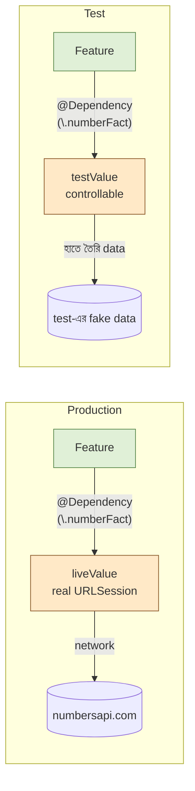

import Callout from '../../components/Callout.astro';
import TryIt from '../../components/TryIt.astro';

<Callout type="tip" title="কোথায় code লিখবে">
চলো `TCAPlayground/Chapter08_Dependencies/` folder-এ নতুন file বানাই, `NumberFactClient.swift`, `NumberFactFeature.swift`, `NumberFactView.swift`। অধ্যায় ০৫-এর URLSession-version-টাকেই refactor করছি।
</Callout>

অধ্যায় ০৫-এ আমরা `URLSession.shared.data(...)` সরাসরি use করেছিলাম। সেখানেই বলেছিলাম, এটা কাজ করে, কিন্তু test-এর জন্য বাজে। এই অধ্যায়ে আমরা সেই বাজে অংশটা ঠিক করবো।

মূল কথা, **Reducer কখনো `URLSession`, `Date`, `UUID`, file system সরাসরি use করবে না।** এই সব *বাইরের জগৎ*-এর জিনিস `@Dependency` দিয়ে inject হবে। তখন test-এ সহজে এদেরকে fake দিয়ে replace করা যাবে।

## কেন Dependency Injection

ভাবো একবার, তোমার reducer-এ এই লাইন:

```swift
let now = Date()        // current time।
let id = UUID()         // random id।
let (data, _) = try await URLSession.shared.data(from: url)
```

এই তিনটার সমস্যা:

১। **Test-এ চলবে না।** Date প্রতিবার আলাদা, `XCTAssertEqual` ভেঙে পড়বে। UUID random, predict করা যাবে না। URLSession network লাগবে, CI-তে slow আর flaky।

২। **App-wide ভিন্নতা।** Production-এ real API, test-এ stub API, preview-এ একটা example data, কোথাও না কোথাও তোমাকে এই switch করতে হবে। code-এ সরাসরি লিখলে এই switch impossible।

৩। **Hidden dependency।** Function signature পড়ে বুঝবে না *"এই function-টা network call করে"*। Function-এর comment বা doc-এ লিখতে হবে। কেউ পড়বে না।

Dependency injection এই তিনটাই সমাধান করে।

## TCA-তে Dependency কীভাবে

TCA-র `swift-dependencies` library দু'টা জিনিস দেয়:

১। একটা **`DependencyKey`** protocol, তুমি client বানাও, এই protocol conform করিয়ে।
২। একটা **`@Dependency`** property wrapper, reducer-এর মধ্যে inject করার জন্য।

চলো একটা NumberFact client বানাই।

## ১. Client define

```swift
// NumberFactClient.swift
import ComposableArchitecture
import Foundation

// Client হয় একটা struct, যেখানে closures থাকে।
struct NumberFactClient {
    var fetch: @Sendable (Int) async throws -> String
}

// DependencyKey conform করিয়ে value provide।
extension NumberFactClient: DependencyKey {

    // Production-এ যা use হবে।
    static let liveValue = NumberFactClient(
        fetch: { number in
            let url = URL(string: "http://numbersapi.com/\(number)")!
            let (data, _) = try await URLSession.shared.data(from: url)
            return String(data: data, encoding: .utf8) ?? "তথ্য পেলাম না"
        }
    )

    // Preview / test-এ যা use হবে।
    static let previewValue = NumberFactClient(
        fetch: { number in
            "নকল data, \(number) আসলেই একটা সংখ্যা।"
        }
    )

    // Test-এ default, `unimplemented` থাকবে যেন accidentally call হলে fail হয়।
    static let testValue = NumberFactClient(
        fetch: unimplemented("NumberFactClient.fetch")
    )
}

// Magic: \.numberFact দিয়ে access করার জন্য DependencyValues extension।
extension DependencyValues {
    var numberFact: NumberFactClient {
        get { self[NumberFactClient.self] }
        set { self[NumberFactClient.self] = newValue }
    }
}
```

তিনটা value:

- **`liveValue`**, আসল production code। Real URLSession।
- **`previewValue`**, SwiftUI Preview-এ। Fake data, instant।
- **`testValue`**, Test-এ। `unimplemented(...)`, যদি কোনো test accidentally এটা call করে, immediately fail হবে। তুমি manually override করে কাজ করাবে।

<Callout type="tip" title="unimplemented মানে কী">
`unimplemented("NumberFactClient.fetch")` মানে, যদি এই closure call হয়, একটা XCTFail হবে। মানে test-এ যদি তুমি client override করতে ভুলে গেছ এবং reducer fetch ডাকছে, test fail। এই *fail-loud* behavior তোমাকে accidental real-API-call থেকে বাঁচায়।
</Callout>

## ২. Reducer-এ inject

```swift
// NumberFactFeature.swift
@Reducer
struct NumberFactFeature {

    @ObservableState
    struct State: Equatable {
        var count = 0
        var fact: String?
        var isLoading = false
    }

    enum Action {
        case incrementTapped
        case decrementTapped
        case factButtonTapped
        case factResponse(String)
        case factFailed
    }

    // ↓ Inject, keypath দিয়ে।
    @Dependency(\.numberFact) var numberFact

    var body: some ReducerOf<Self> {
        Reduce { state, action in
            switch action {

            case .incrementTapped:
                state.count += 1
                return .none

            case .decrementTapped:
                state.count -= 1
                return .none

            case .factButtonTapped:
                state.isLoading = true
                return .run { [count = state.count] send in
                    let fact = try await numberFact.fetch(count)
                    await send(.factResponse(fact))
                } catch: { _, send in
                    await send(.factFailed)
                }

            case let .factResponse(fact):
                state.isLoading = false
                state.fact = fact
                return .none

            case .factFailed:
                state.isLoading = false
                state.fact = "ইন্টারনেট-এ সমস্যা।"
                return .none
            }
        }
    }
}
```

এক জায়গায় বদল, `URLSession.shared.data(...)` সরে গিয়ে `numberFact.fetch(count)` এসেছে। বাকি সব আগের মতো।

## ৩. View

View-এ কোনো বদল নেই, `View` জানেই না dependency কী। সেটাই বড় সুবিধা।

```swift
struct NumberFactView: View {
    let store: StoreOf<NumberFactFeature>

    var body: some View {
        VStack {
            Text("\(store.count)")
                .font(.system(size: 64, weight: .bold))

            HStack {
                Button("−") { store.send(.decrementTapped) }
                Button("+") { store.send(.incrementTapped) }
            }

            Button("Fact আনো") { store.send(.factButtonTapped) }
                .disabled(store.isLoading)

            if let fact = store.fact { Text(fact) }
        }
    }
}
```

## ৪. App entry

```swift
NavigationLink("০৮, Dependencies") {
    NumberFactView(
        store: Store(initialState: NumberFactFeature.State()) {
            NumberFactFeature()
        }
        // ↑ Production-এ liveValue automatic use হবে।
    )
}
```

Run করো, আগের মতোই চলবে।

## Override করতে চাও?, এক লাইনে

কোনো particular screen-এ test বা preview-র জন্য fake client দিতে চাও?, Store creation-এ `dependencies:` block দাও।

```swift
NumberFactView(
    store: Store(initialState: NumberFactFeature.State()) {
        NumberFactFeature()
    } withDependencies: {
        $0.numberFact = NumberFactClient(
            fetch: { _ in "এই preview-তে এটা সবসময় same।" }
        )
    }
)
```

`withDependencies:` block-এ যা set করো, শুধু এই Store-এর জন্য। বাকি app-এ কোনো প্রভাব নেই।

## কিছু built-in dependencies

Swift Dependencies library অনেক built-in dependency নিয়ে আসে:

```swift
@Dependency(\.date) var date            // Date.now-এর জায়গায়।
@Dependency(\.uuid) var uuid            // UUID()-এর জায়গায়।
@Dependency(\.continuousClock) var clock // Task.sleep-এর জন্য।
@Dependency(\.mainQueue) var mainQueue   // dispatch queue।
@Dependency(\.openURL) var openURL       // UIApplication.shared.open।
@Dependency(\.locale) var locale         // Locale.current।
```

প্রতিটার একটা liveValue (real), একটা testValue (controllable)। তাই reducer-এ লিখো:

```swift
@Dependency(\.date) var date
@Dependency(\.uuid) var uuid

case .submitTapped:
    let entry = LogEntry(
        id: uuid(),
        createdAt: date.now,
        text: state.draftText
    )
    state.entries.append(entry)
    return .none
```

Test-এ:

```swift
let store = TestStore(initialState: ...) {
    Feature()
} withDependencies: {
    $0.date = .constant(Date(timeIntervalSince1970: 1234567890))
    $0.uuid = .incrementing
}
```

`uuid = .incrementing` মানে, প্রতিবার `uuid()` call করলে `00000000-0000-0000-0000-000000000000`, `00000000-0000-0000-0000-000000000001`, … predictable। Test-এ আমরা ঠিক জানি কোন uuid আসবে।

## এক ছবিতে, Production vs Test



Feature-এর code একই। শুধু `numberFact`-এর behind কী আছে সেটা ভিন্ন।

## চা স্টলে যেমন

<Callout type="tea-stall">
ছোট ভাই করিম এ এক জন, তার সাথে দু'রকম ব্যবহার হতে পারে।

**Production-এ** (আসল স্টলে): করিম দৌড়ে গিয়ে আসল বাজারে দুধ কেনে। সময় লাগে। কখনো বাজার বন্ধ থাকলে empty হাতে ফেরে।

**Test-এ** (rehearsal): মামার পেছনে আগে থেকেই দুধ রাখা, *"করিম, এই দুধটা নাও।"* তাৎক্ষণিক। কোনো random factor নেই। আমরা rehearsal-এ বাজার যাচাই করছি না, মামার logic যাচাই করছি।

`@Dependency` মানে, *"করিম যেখান থেকেই আসুক না কেন, মামার logic একই থাকবে। আমরা শুধু environment বদলাচ্ছি।"*
</Callout>

## কিছু rules

১। **Reducer-এ `URLSession`, `Date`, `UUID`, `FileManager`, `Notification` direct লিখো না।** সব dependency দিয়ে inject।

২। **Client-গুলো struct of closures** হিসেবে রাখো, protocol দিয়ে না। Closures use করলে partial override সহজ (`testValue`-এ শুধু `fetch` override করলে চলবে, বাকি keep default)।

৩। **Live, preview, test, তিনটা value সবসময় দিতে চেষ্টা করো।** না দিলে fallback runs, কিন্তু explicit better।

## নিজে চেষ্টা করো

<TryIt title="একটা WeatherClient বানাও">
একটা ছোট `WeatherClient` বানাও:

```swift
struct WeatherClient {
    var current: @Sendable (String) async throws -> Double  // city name → temperature
}
```

- `liveValue`, fake-ই দাও আপাতত (`return Double.random(in: 20...35)`)।
- `previewValue`, সবসময় `30.0` return করুক।
- `testValue`, `unimplemented(...)`।

`DependencyValues`-এ extension যোগ, `var weather: WeatherClient`।

তারপর একটা ছোট `WeatherFeature` বানাও যেটা button tap-এ Dhaka-র temperature load করে। `@Dependency(\.weather) var weather`।
</TryIt>

## এই অধ্যায়ের সারমর্ম

<Callout type="remember">
- **`Client = struct of closures`**, `DependencyKey` conform, `liveValue`, `previewValue`, `testValue`।
- **`extension DependencyValues`** দিয়ে keypath access।
- **`@Dependency(\.client) var client`** reducer-এ inject।
- **`withDependencies:`** block দিয়ে preview/test-এ override।
- `URLSession`, `Date`, `UUID`, file, সব বাইরের জিনিস dependency-এ wrap করো।
</Callout>

<Callout type="checkpoint">
এখন তোমার reducer-এ `URLSession`, `Date`, `UUID` সরাসরি নেই, সব dependency-তে wrap করা। Test লেখার রাস্তা পরিষ্কার।
</Callout>

<Callout type="level-up">
🎉 **Level Up!** Production-এ আসল, test-এ fake, এক switch-এ পরিবর্তন। পরের quest-ই TCA-র সবচেয়ে বড় উপহার: **detective হয়ে test লেখা।**
</Callout>
