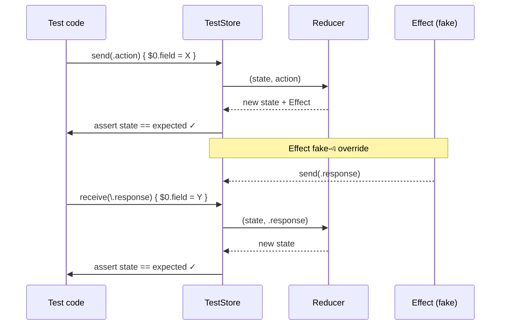

import Callout from '../../components/Callout.astro';
import TryIt from '../../components/TryIt.astro';

<Callout type="tip" title="কোথায় code লিখবে">
চলো `TCAPlaygroundTests/` folder-এ (Xcode auto-create করে দিয়েছে) নতুন একটা Swift test file বানাই — `Chapter09_TestingTests.swift`। যদি test target না থাকে, File → New → Target → Unit Testing Bundle দিয়ে তৈরি করো।
</Callout>

ধরো তুমি একজন secret inspector। চা স্টল-এ সবকিছু ঠিকঠাক চলছে কিনা — সেটা verify করতে এসেছ। কিন্তু সরাসরি জিজ্ঞেস করলে মামা সবসময় বলবে *"সব ঠিক!"* — তাই তুমি একটা special trick ব্যবহার করো:

তুমি একটা সাজানো customer হও। একটা order পাঠাও — *"এক কাপ চা"* — তারপর নিজেই check করো: বোর্ডে ঠিকঠাক লেখা হলো কি? ঠিক দুধ আনতে ছোট ভাইটাকে পাঠানো হলো কি? দাম ঠিক যোগ হলো কি?

এটাই **TestStore**। TCA-র এই tool-টা একটা magic glass case-এর মতো — তুমি action পাঠাও, তারপর exact দেখো state কীভাবে বদলালো, কী effect চললো, কী response এলো। সব এক জায়গায়, কোনো লুকানো নেই।

## কেন TCA-র testing এত সহজ?

MVVM-এ test লেখা যে কী cumbersome — মনে আছে? Mock object বানাও, expectation বানাও, fulfill করো, `XCTestExpectation.wait(for:)` — দশ লাইন test-এর জন্য চল্লিশ লাইন boilerplate। ফলে অনেক developer test-ই লেখে না।

TCA-তে চারটা জিনিস test-কে এক জগৎ এগিয়ে নেয় —

- **State একটা plain struct** — `@Published` properties-এর মতো hide না, যেকোনো test থেকে inspect করা যায়।
- **Action একটা enum** — predictable, exhaustive। তুমি জানো কী কী হতে পারে।
- **Reducer pure** — effect ছাড়া। একই input দিলে একই output। `XCTestExpectation`-এর কষ্ট নেই।
- **Effect dependency-তে wrap** — সব বাইরের জিনিস inject হয়, fake দিয়ে replace হয়।

ফলে — TCA-র test লেখা MVVM-এর চেয়ে অনেক কম কষ্ট, কিন্তু confidence অনেক বেশি। দশ মিনিটে একটা feature-এর full test coverage সম্ভব।

<Callout type="power-up">
আসল magic — TestStore তোমাকে exact diff দেখায়। কোন property বদলেছে, কোনটা বদলায়নি, কী expected ছিল, কী হলো। Bug-এর জায়গা আঙুল দিয়ে দেখায়।
</Callout>

## Xcode-এ Test কোথায় থাকে?

Xcode auto-create করে যখন তুমি প্রথম project বানাও — `TCAPlaygroundTests/` নামে একটা folder। এটাই তোমার test target।

- **Test Navigator**: বাম sidebar-এ একটা diamond ◇ icon — click করলে সব test শ্রেণীবদ্ধ দেখাবে।
- **⌘U**: সব test একসাথে run।
- **Gutter-এর diamond**: code-এর বাঁ পাশে — green ◇ = pass, red ◇ = fail, hollow = run করা হয়নি।
- **Failure message**: test fail হলে Xcode সরাসরি সেই line-এ navigate করবে, error message দেখাবে।

<Callout type="cheat-code">
একটা test-এর পাশের diamond-এ click করলে শুধু সেই test-টা run হয়। সব নয়। বড় test suite-এ সময় বাঁচায়।
</Callout>

## প্রথম Test — Counter বানাও green

চলো একদম শুরু থেকে। আমাদের পুরনো `CounterFeature`-এর জন্য একটা test লিখি।

```swift
import ComposableArchitecture
import XCTest
@testable import TCAPlayground   // আমাদের নিজের module।

@MainActor
final class CounterFeatureTests: XCTestCase {

    func test_increment_button_বাড়ায়_count() async {
        // ১. TestStore বানাই — magic glass case।
        let store = TestStore(initialState: CounterFeature.State()) {
            CounterFeature()
        }

        // ২. Action পাঠাই, expected state mutation assert করি।
        // TestStore exact বলবে — state কী বদলালো, কী বদলায়নি।
        await store.send(.incrementTapped) {
            $0.count = 1   // expected: count ১ হবে।
        }
    }
}
```

এই ১৫ লাইনে যা ঘটল —

- `@MainActor` — test main thread-এ চলবে। TCA সাধারণত main-এ render হয়, তাই এই annotation।
- `TestStore(initialState: ...) { Feature() }` — একটা special store শুধু test-এর জন্য।
- `await store.send(.incrementTapped) { $0.count = 1 }` — *"এই action পাঠাচ্ছি; পাঠানোর পর state-এর count হবে 1।"*

মূল কথা — `{ $0.count = 1 }` block-এ তুমি **expected state mutation** describe করছ। আসল state কী হয়েছে — TestStore নিজে check করে, তোমার expectation-এর সাথে মেলায়।

### যদি ভুল expectation লিখ?

ধরো অসাবধানে লিখলে —

```swift
await store.send(.incrementTapped) {
    $0.count = 5   // ভুল! আসলে ১ হবে।
}
```

TestStore থামিয়ে দিয়ে বলবে —

```
A state change does not match expectation:

  CounterFeature.State(
−   count: 5
+   count: 1
  )
```

`−` expected, `+` actual। SwiftUI-র diff-এর মতো — exact কোথায় mismatch।

<Callout type="power-up">
এই diff message TestStore-এর জাদু। কোনো `XCTAssertEqual` লিখতে হলো না, কোনো manual comparison না — TestStore নিজে compare করে exact difference জানায়। বড় state-এ এটা ১০ গুণ সময় বাঁচায়।
</Callout>

## আরো গভীরে — multiple steps

একই test-এ অনেক step describe করা যায়:

```swift
func test_একাধিক_action_chain() async {
    let store = TestStore(initialState: CounterFeature.State()) {
        CounterFeature()
    }

    // Step ১
    await store.send(.incrementTapped) { $0.count = 1 }
    // Step ২
    await store.send(.incrementTapped) { $0.count = 2 }
    // Step ৩
    await store.send(.decrementTapped) { $0.count = 1 }
}
```

প্রতিটা step-এ state describe করছি। যদি step ২-এ ভুল হয়, test report বলবে — *"Step ২-এ mismatch।"* Line number সহ।

## Effect Test — ছোট ভাই বাজারে গেল কিনা

এতক্ষণ শুধু sync action — কোনো effect ছিল না। এবার async-এ যাই। NumberFact feature-এর test, যেটায় API call আছে।

```swift
func test_factButton_API_call_করে_response_আনে() async {
    let store = TestStore(initialState: NumberFactFeature.State(count: 42)) {
        NumberFactFeature()
    } withDependencies: {
        // আসল API replace করি একটা fake দিয়ে — যেটা instant return করে।
        $0.numberFact = NumberFactClient(
            fetch: { count in
                "\(count) একটা মজার সংখ্যা।"
            }
        )
    }

    // Step ১: User button-এ tap করল।
    await store.send(.factButtonTapped) {
        $0.isLoading = true
    }

    // Step ২: Effect থেকে যে action আসবে, সেটাও assert করি।
    await store.receive(\.factResponse) {
        $0.isLoading = false
        $0.fact = "42 একটা মজার সংখ্যা।"
    }
}
```

তিনটা গুরুত্বপূর্ণ ব্যাপার —

### `withDependencies:` block

TestStore creation-এ এই block। এখানে আমরা `numberFact.fetch` কে force করেছি — সবসময় return করবে `"42 একটা মজার সংখ্যা।"`। আসল network নেই। তাই test fast, deterministic, offline-যোগ্য।

চা স্টলে এটাই — fake করিম রেডি রাখা। বাজার যাওয়ার আগেই হাতে দুধ দিয়ে দেওয়া। মামার logic পুরোপুরি test হয়, কিন্তু network লাগে না।

### `store.receive(\.factResponse) { ... }`

Reducer `.run` effect ফেরাচ্ছে, যেটা শেষে `send(.factResponse(...))` করে। TestStore বলবে — *"এই action arrival expect কর; receive করার সময় state কী হওয়া উচিত — describe কর।"*

`\.factResponse` হলো **case keypath** — Swift-এর powerful feature। তুমি লিখলে অর্ধেক match (`.factResponse`-এর associated value পরে আসছে)। যদি specific value match করতে চাও:

```swift
await store.receive(\.factResponse) { action in
    // action এখন .factResponse(String)
    XCTAssertEqual(action, "42 একটা মজার সংখ্যা।")
} assert: {
    $0.fact = "42 একটা মজার সংখ্যা।"
}
```

### Effect arrived না? — test fail

যদি reducer accidentally effect ফেরাতে ভুলে যায়, বা effect-এর ভেতরে send miss করে — TestStore বলবে *"একটা expected receive আছে যা arrive করেনি।"*

আর যদি unexpected effect arrive করে — যেটা তুমি receive করোনি — TestStore বলবে *"একটা unhandled action আছে।"*

দুই দিক থেকেই strict — কোনো effect slip out করে না।

<Callout type="boss-battle">
Effect testing প্রথমবার একটু কঠিন মনে হবে — `withDependencies` কোথায় বসাবে, কোন action receive করতে হবে, exhaustive vs non-exhaustive কোনটা use করবে। ধীরে ধীরে practice — এক সপ্তাহ পর তুমি এটা চোখ বন্ধ করে লিখবে।
</Callout>

## TestClock — সময়কে control করো

কোনো feature-এ timer আছে? Debounce আছে? Throttle আছে? — সরাসরি `Task.sleep` use করলে test-এ বসে অপেক্ষা করতে হবে। TestClock দিয়ে এটা একদম instant।

```swift
@Reducer
struct TimerFeature {
    @ObservableState
    struct State: Equatable {
        var count = 0
        var isRunning = false
    }
    enum Action {
        case startButtonTapped
        case stopButtonTapped
        case tick
    }

    @Dependency(\.continuousClock) var clock

    var body: some ReducerOf<Self> {
        Reduce { state, action in
            switch action {
            case .startButtonTapped:
                state.isRunning = true
                return .run { send in
                    for await _ in clock.timer(interval: .seconds(1)) {
                        await send(.tick)
                    }
                }
                .cancellable(id: "timer", cancelInFlight: true)

            case .stopButtonTapped:
                state.isRunning = false
                return .cancel(id: "timer")

            case .tick:
                state.count += 1
                return .none
            }
        }
    }
}
```

Test:

```swift
func test_timer_প্রতি_সেকেন্ডে_count_বাড়ায়() async {
    let clock = TestClock()
    let store = TestStore(initialState: TimerFeature.State()) {
        TimerFeature()
    } withDependencies: {
        $0.continuousClock = clock   // আসল ঘড়ির বদলে fake ঘড়ি।
    }

    await store.send(.startButtonTapped) {
        $0.isRunning = true
    }

    // আমি ১ সেকেন্ড "এগিয়ে দিচ্ছি" — কিন্তু real-time অপেক্ষা নয়।
    await clock.advance(by: .seconds(1))
    await store.receive(\.tick) { $0.count = 1 }

    await clock.advance(by: .seconds(2))
    await store.receive(\.tick) { $0.count = 2 }
    await store.receive(\.tick) { $0.count = 3 }

    // Timer stop।
    await store.send(.stopButtonTapped) {
        $0.isRunning = false
    }
}
```

কী হলো এখানে — `clock.advance(by: .seconds(1))` মানে *"fake ঘড়িকে এক সেকেন্ড এগিয়ে দাও"*। সেই মুহূর্তে timer effect এক tick-এর জন্য ready। Real time-এ কোনো অপেক্ষা নেই — ১০ সেকেন্ডের timer test ০.০০১ সেকেন্ডে চলে।

<Callout type="power-up">
TestClock দিয়ে ১০ মিনিটের long-running timer test করা যায় ১ second-এ। কোনো sleep নেই, কোনো flaky test নেই। CI-তে test green থাকে।
</Callout>

## পুরো TestStore flow এক নজরে



প্রতিটা arrow-এ assertion আছে। কোনো লুকানো পরিবর্তন test-এ slip করতে পারে না।

## Exhaustivity — কখন কড়া, কখন নরম

Default-এ TestStore **exhaustive**। মানে প্রতিটা state change, প্রতিটা receive — সব assert করতে বাধ্য। এই strictness তোমাকে accidentally কিছু miss করতে দেয় না।

কখনো কখনো এটা অতিরিক্ত — যেমন legacy feature যেখানে অনেক side effect আছে, কিন্তু তুমি শুধু একটা specific behavior test করতে চাইছ। তখন:

```swift
let store = TestStore(initialState: ...) {
    LargeFeature()
}
store.exhaustivity = .off   // partial assertion ok।

await store.send(.someAction) {
    $0.someField = "expected"
    // বাকি state-এর কথা না বললেও চলবে।
}
```

কিন্তু এটা use করো খুব selectively।

<Callout type="boss-battle">
শুরুতে exhaustive রাখো। শেখার জন্য best — TCA তোমাকে force করে সব কিছু বুঝতে। আস্তে আস্তে যখন বুঝে যাবে কী কী হচ্ছে, তখন legacy code-এ `.off`-এ যেতে পারো। কিন্তু নতুন code — সবসময় exhaustive।
</Callout>

## Date, UUID — predictable test

কোনো feature-এ `Date.now` বা `UUID()` direct লিখলে — test-এ চলবে না (প্রতিবার আলাদা)। তাই আমরা অধ্যায় ০৮-এ শিখেছিলাম — সব `@Dependency` দিয়ে।

Test-এ override —

```swift
let store = TestStore(initialState: NotesFeature.State(draft: "Hello")) {
    NotesFeature()
} withDependencies: {
    $0.uuid = .incrementing
    $0.date.now = Date(timeIntervalSince1970: 1_700_000_000)
}

await store.send(.addTapped) {
    $0.notes = [
        Note(
            id: UUID(0),    // .incrementing → first uuid: 00000000-...-0000
            createdAt: Date(timeIntervalSince1970: 1_700_000_000),
            text: "Hello"
        )
    ]
    $0.draft = ""
}
```

`uuid = .incrementing` predictable uuid generate করে — `00...0000`, `00...0001`, ইত্যাদি। Date fixed। Test reliable, repeatable।

## একটা real example — NumberFact feature-এর পুরো test

চলো একটা পুরো feature-এর সব path test করি। ৪টা test — success, error, cancel mid-fetch, rapid taps।

```swift
@MainActor
final class NumberFactFeatureTests: XCTestCase {

    // ১. Success path।
    func test_fact_API_success() async {
        let store = TestStore(initialState: NumberFactFeature.State(count: 7)) {
            NumberFactFeature()
        } withDependencies: {
            $0.numberFact = NumberFactClient(
                fetch: { count in "\(count) প্রিয় সংখ্যা।" }
            )
        }

        await store.send(.factButtonTapped) {
            $0.isLoading = true
        }
        await store.receive(\.factResponse) {
            $0.isLoading = false
            $0.fact = "7 প্রিয় সংখ্যা।"
        }
    }

    // ২. Error path।
    func test_fact_API_failure() async {
        struct DummyError: Error {}

        let store = TestStore(initialState: NumberFactFeature.State(count: 3)) {
            NumberFactFeature()
        } withDependencies: {
            $0.numberFact = NumberFactClient(
                fetch: { _ in throw DummyError() }
            )
        }

        await store.send(.factButtonTapped) {
            $0.isLoading = true
        }
        await store.receive(\.factFailed) {
            $0.isLoading = false
            $0.fact = "ইন্টারনেট-এ সমস্যা।"
        }
    }

    // ৩. Increment করলে fact mute হওয়া উচিত।
    func test_increment_fact_clear_করে() async {
        let store = TestStore(
            initialState: NumberFactFeature.State(count: 5, fact: "old fact")
        ) {
            NumberFactFeature()
        }

        await store.send(.incrementTapped) {
            $0.count = 6
            $0.fact = nil
        }
    }

    // ৪. Negative count rule (যদি add করি)।
    func test_decrement_zero_এর_নিচে_যায়_না() async {
        let store = TestStore(initialState: NumberFactFeature.State(count: 0)) {
            NumberFactFeature()
        }

        // count 0-এ থাকলে decrement কিছু করবে না।
        // (এটা feature-এ rule হিসেবে add করতে হবে আগে।)
        await store.send(.decrementTapped)
        // কোনো state mutation নেই — block-ই দিইনি।
    }
}
```

চারটা test, প্রতিটা ১৫-২০ লাইন। MVVM-এ একই test লিখতে গেলে — `URLProtocol` mock বা `FileManager` protocol বা `XCTestExpectation` — প্রতিটা test ৪০-৫০ লাইন হতো।

<Callout type="checkpoint">
- TestStore প্রতিটা state mutation আর effect-action exhaustively check করে।
- `withDependencies` block-এ fake clients, predictable Date/UUID, TestClock।
- `store.send` sync, `store.receive` async effect থেকে আসা action।
- Failure message exact diff দেখায় — debug সহজ।
- Default exhaustive — accidentally কিছু miss করার সুযোগ নেই।
</Callout>

## চা স্টলে যেমন

<Callout type="tea-stall">
TestStore মানে — *fake-customer* হয়ে rehearsal চালানো। আমরা মামাকে বলি *"নাও, এক কাপ চা order দিচ্ছি — দেখো তোমার বোর্ডে এই লেখাটা হওয়া উচিত।"*। মামা বোর্ডে যা লিখলো — আমরা compare করি। মেলে না? — *"না মামা, এটা ভুল হয়েছে।"* বলে test fail। মেলে? — pass।

ছোট ভাই করিম-কে আমরা rehearsal-এ পাঠাই না বাজারে — fake করিম রেডি রাখি, দুধ আগে থেকেই হাতে। এটাই `withDependencies` দিয়ে fake client। মামার logic পুরোপুরি test হলো, কিন্তু network লাগেনি।
</Callout>

## নিজে চেষ্টা করো

<TryIt title="চারটা test লেখো">
আগের counter feature-এর জন্য চারটা test লেখো —

১। দু'বার increment করে count যেন `2` হয়।
২। `decrementTapped` কখনো count negative হতে দেয় না (যদি তুমি এই rule add করো)।
৩। Reset action add করলে — reset করলে count `0`।
৪। 10 reach করলে কোনো increment effect হয় না।

প্রতিটায় expected state describe করো। ⌘U চাপো — সব green হোক।
</TryIt>

## এই অধ্যায়ের সারমর্ম

<Callout type="remember">
- **TestStore** force করে exhaustive state assertion।
- `store.send(.action) { $0.field = expected }` — sync mutation describe।
- `store.receive(\.action) { ... }` — effect থেকে আসা action handle।
- `withDependencies:` দিয়ে test-এ fake client, Date, UUID, TestClock।
- Mismatch হলে test report exact diff দেয়।
- Default exhaustive — থাকুক ওভাবেই।
</Callout>

<Callout type="level-up">
🎉 **Level Up!** তুমি এখন detective হিসেবে graduate। যেকোনো TCA feature-এর state, action, effect — সবই তোমার magic glass case-এ। পরের quest-এ আমরা detective থেকে hunter হবো — **bug শিকার**!
</Callout>
