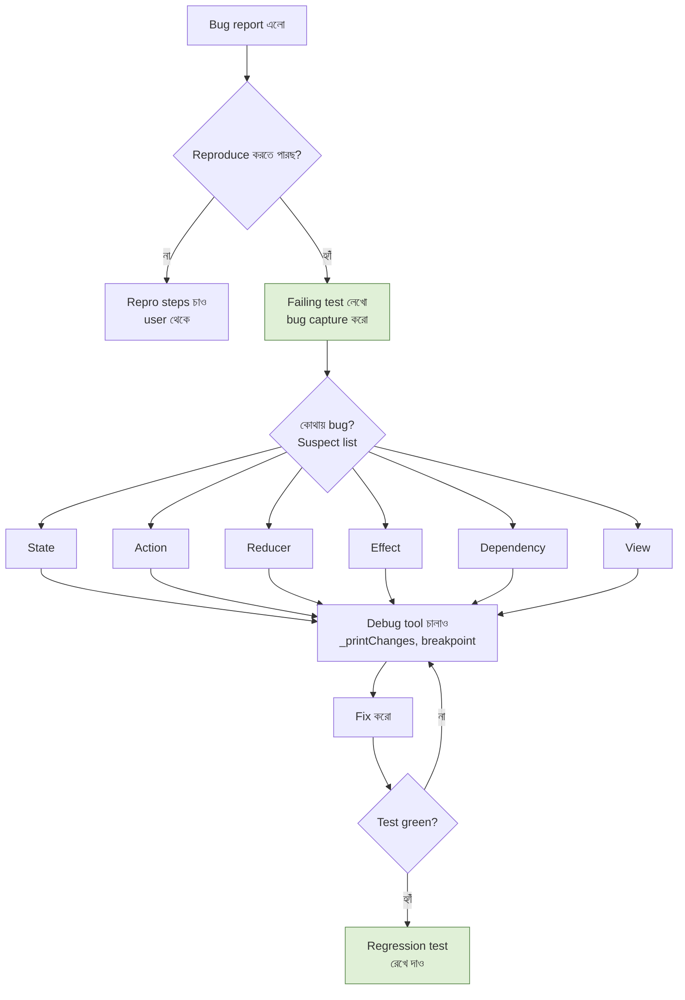

import Callout from '../../components/Callout.astro';
import TryIt from '../../components/TryIt.astro';

রাত ১১টা। তোমার phone-এ message:

> *"App-টা production-এ ভেঙে গেছে। User-রা complain করছে — order place করলে কখনো কখনো ভুল total দেখাচ্ছে। কাল সকালের মধ্যে fix চাই।"*

তুমি laptop খুলো। চা ঢালো। চলো bug শিকার। 🕵️

এই অধ্যায় একটু আলাদা — ৫টা **case** থাকবে। প্রতিটা case = একটা real TCA bug pattern। Symptom দেখবে → tool ব্যবহার করে cause খুঁজবে → fix দেখবে। গল্প করে শেখা — কারণ bug সবসময় গল্পের মতোই আসে।

<Callout type="mystery">
এই ৫টা case তুমি real-world TCA project-এ কখনো না কখনো ঠিক এভাবেই দেখবে। মুখস্থ না — pattern চিনে রাখো। পরের বার যখন দেখবে, তুমি জানবে কোথায় তাকাতে হবে।
</Callout>

## Case ১ — *"State বদলেছে, কিন্তু UI refresh হচ্ছে না"*

**Symptom**: তুমি action send করছ, reducer-এ state বদলাচ্ছে (breakpoint-এ verify), কিন্তু screen-এ পুরনো value-ই দেখাচ্ছে।

### Investigation

প্রথম সন্দেহ — State struct-এ `@ObservableState` macro আছে কি?

```swift
// বাজে — কোনো observation নেই।
@Reducer
struct ProfileFeature {
    struct State: Equatable {
        var name: String = ""
    }
    // ...
}
```

```swift
// ভালো — @ObservableState macro যোগ।
@Reducer
struct ProfileFeature {
    @ObservableState
    struct State: Equatable {
        var name: String = ""
    }
    // ...
}
```

দ্বিতীয় সন্দেহ — View-এ store-এর state access ঠিকমতো হচ্ছে কি?

```swift
// বাজে — store.state.name (পুরনো TCA pattern)।
Text(store.state.name)

// ভালো — সরাসরি store.name (modern, @ObservableState এর সুবিধা)।
Text(store.name)
```

তৃতীয় সন্দেহ — যদি View `@Bindable` দরকার (TextField binding-এর জন্য) কিন্তু সাধারণ `let store: StoreOf<...>` হয়েছে:

```swift
// বাজে — Bindable না, $store.name কাজ করবে না।
struct ProfileView: View {
    let store: StoreOf<ProfileFeature>
    var body: some View {
        TextField("Name", text: $store.name)   // compile error
    }
}

// ভালো — @Bindable।
struct ProfileView: View {
    @Bindable var store: StoreOf<ProfileFeature>
    var body: some View {
        TextField("Name", text: $store.name)
    }
}
```

<Callout type="mystery">
এই bug অনেক TCA developer-এর প্রথম bug। চিন্তা নেই — এক মিনিটে fix। শুধু macro মনে রাখতে হবে: `@ObservableState` state-এ, `@Bindable` view-এ।
</Callout>

### Fix Recipe

১। `State` struct-এর উপরে `@ObservableState` আছে কি check করো।
২। `Equatable` conform আছে কি।
৩। View-এ `store.field` সরাসরি access (`.state.field` নয়)।
৪। Binding লাগলে View-এ `@Bindable var store: ...`।

## Case ২ — *"Effect কখনো fire-ই করছে না"*

**Symptom**: Action পাঠাচ্ছ, network call যাওয়ার কথা — কিন্তু Charles Proxy-তে কোনো request নেই। API call হচ্ছেই না।

### Investigation

প্রথম সন্দেহ — Reducer-এ accidentally `.none` ফেরাচ্ছ effect-এর জায়গায়?

```swift
// বাজে — return .none দেওয়াতে effect কখনো চলে না।
case .factButtonTapped:
    state.isLoading = true
    .run { send in
        let fact = try await numberFact.fetch(state.count)
        await send(.factResponse(fact))
    }
    return .none      // ← এই লাইনটা সব ম্যাজিক নষ্ট করছে।
```

```swift
// ভালো — effect সরাসরি return।
case .factButtonTapped:
    state.isLoading = true
    return .run { send in
        let fact = try await numberFact.fetch(state.count)
        await send(.factResponse(fact))
    }
```

দ্বিতীয় সন্দেহ — action আদৌ pulled হচ্ছে কি? Reducer-এর body-তে `_printChanges()` add করো:

```swift
var body: some ReducerOf<Self> {
    Reduce { state, action in
        // ... existing logic
    }
    ._printChanges()   // ⚡ প্রতিটা action আর state diff console-এ।
}
```

Run করার পর Xcode console খোলো। প্রতিটা action আসার সাথে সাথে console-এ এমন কিছু আসবে —

```
received action:
  NumberFactFeature.Action.factButtonTapped
NumberFactFeature.State(
  count: 5,
- isLoading: false,
+ isLoading: true,
  fact: nil
)
```

যদি action arrive-ই না করে — মানে View থেকে `store.send(...)` পৌঁছাচ্ছে না। Button binding check করো।

<Callout type="power-up">
`_printChanges()` TCA-র best debugging tool। Production build-এ inactive থাকে, development-এ সব action আর state diff console-এ। কোনো হারিয়ে যাওয়া action আর লুকানো থাকে না।
</Callout>

### Fix Recipe

১। Effect-এর আগে `return` আছে কি?
২। `_printChanges()` দিয়ে actions log করো।
3. View-এ button-এ `store.send(.action)` লেখা আছে কি, না action enum-এর wrong case পাঠাচ্ছ?
4. Parent feature হলে — `Scope` দিয়ে child-কে wire করা আছে কি?

## Case ৩ — *"Wrong action received in test"*

**Symptom**: Test লিখেছ, expecting `\.factResponse`, কিন্তু actual এসেছে `\.factFailed`।

```
A different action was received than expected:

− expected: factResponse(...)
+ actual:   factFailed
```

### Investigation

প্রথম সন্দেহ — mock dependency error throw করছে?

```swift
// সাবধান — closure-এর ভেতরে error throw হতে পারে।
$0.numberFact = NumberFactClient(
    fetch: { count in
        guard count > 0 else { throw DummyError() }
        return "\(count) মজার সংখ্যা।"
    }
)
```

যদি initial state-এ `count = 0` থাকে — fetch throw করবে, effect-এর catch block ধরবে, `.factFailed` action যাবে। অথচ test expecting success।

দ্বিতীয় সন্দেহ — `receive` block-এর form। Closure form ব্যবহার করো actual action inspect করতে:

```swift
await store.receive(\.factResponse) { action in
    // action এখন the actual case associated value।
    print("Got:", action)
} assert: {
    $0.fact = "..."
}
```

এই form-এ তুমি debugger-এ পুরো action দেখতে পারো।

তৃতীয় সন্দেহ — Effect-এর ভেতরে try-catch:

```swift
return .run { send in
    let fact = try await numberFact.fetch(count)
    await send(.factResponse(fact))
}
catch: { error, send in
    print("Error caught:", error)   // debug-এ এটা log হবে
    await send(.factFailed)
}
```

`catch:` block-এর ভেতরে breakpoint বসাও, error inspect করো।

### Fix Recipe

১। Mock client check — input value-এর কারণে error throw হচ্ছে?
২। Effect-এ `catch:` block-এ breakpoint।
3. `store.receive` closure-form দিয়ে actual action দেখো।
4. Initial state values realistic কি?

## Case ৪ — *"Race condition — দুইটা effect একসাথে চলছে"*

**Symptom**: User দ্রুত দু'বার search button-এ tap করেছে। প্রথম query-র result আসার আগেই দ্বিতীয় query চলছে। Result এলোমেলো — কখনো প্রথম query-র response দেখাচ্ছে, কখনো দ্বিতীয়।

### Investigation

প্রতিটা concurrent search একটা আলাদা effect — কোনটা শেষে state-এ লেখে, সেটাই *win* করছে। Order guaranteed না।

### Fix — `.cancellable(id:)`

Effect-কে একটা id দাও। নতুন effect শুরু হলে আগেরটা cancel।

```swift
case .searchButtonTapped:
    return .run { [query = state.query] send in
        let results = try await searchClient.search(query)
        await send(.searchResponse(results))
    }
    .cancellable(id: SearchID.self, cancelInFlight: true)
    //                                ↑ এটাই magic — পুরনো call cancel।

private enum SearchID {}
```

`cancelInFlight: true` মানে — *"এই id-র আগের কোনো effect চললে সেটা cancel করো, তারপর এই নতুনটা শুরু করো।"*

চা স্টলে এটাই — ছোট ভাই করিম-কে নাম ধরে চিৎকার করে ফিরিয়ে আনা। *"করিম, ফিরে আয়! পুরনো order বাদ, নতুন order এসেছে।"*

<Callout type="boss-battle">
Race condition হলো TCA-র সবচেয়ে subtle bug-এর জায়গা। চোখে কম পড়ে, test-এও miss হতে পারে যদি না rapid taps simulate করো। প্রতিটা effect যেখানে user দ্রুত trigger করতে পারে — সেখানে `.cancellable(id:, cancelInFlight: true)` ভাবো।
</Callout>

### Test-এ রাণিত

```swift
func test_rapid_taps_cancels_previous() async {
    let store = TestStore(initialState: SearchFeature.State(query: "ch")) {
        SearchFeature()
    } withDependencies: {
        $0.searchClient.search = { _ in
            try await Task.sleep(for: .seconds(1))
            return ["চা"]
        }
    }

    await store.send(.searchButtonTapped)
    await store.send(.searchButtonTapped)   // আগেরটা cancel হবে।

    // শুধু দ্বিতীয়টার response receive করতে হবে।
    await store.receive(\.searchResponse) {
        $0.results = ["চা"]
    }
}
```

## Case ৫ — *"Test passes, production crashes"*

**Symptom**: ⌘U সব green। Local-এ চালালেও সব ঠিক। কিন্তু production-এ user reports — *"App opens এ crash."*।

### Investigation

প্রথম সন্দেহ — কোনো dependency `liveValue` define করা নেই।

ধরো তুমি একটা `AnalyticsClient` বানিয়েছ —

```swift
struct AnalyticsClient {
    var log: @Sendable (String) async -> Void
}

extension AnalyticsClient: DependencyKey {
    static let testValue = AnalyticsClient(
        log: { _ in }
    )
    // ❌ liveValue define করা নেই!
}
```

Local test-এ `testValue` use হচ্ছে — সব fine। কিন্তু production build-এ — যখন `liveValue` দরকার, TCA fallback করে `testValue`-এ। যদি `testValue` `unimplemented(...)` হয় — crash। যদি `testValue` define-ই না থাকে — compile error, কিন্তু `liveValue` না থাকলে runtime warning + fallback।

### Fix

প্রতিটা DependencyKey-এ **তিনটাই** value দাও — যত boilerplate বেশি লাগুক না কেন।

```swift
extension AnalyticsClient: DependencyKey {
    static let liveValue = AnalyticsClient(
        log: { message in
            // আসল analytics SDK call।
            FirebaseAnalytics.log(message)
        }
    )

    static let previewValue = AnalyticsClient(
        log: { print("[preview] \($0)") }
    )

    static let testValue = AnalyticsClient(
        log: unimplemented("AnalyticsClient.log")
    )
}
```

<Callout type="warn" title="প্রতিটা DependencyKey-এ liveValue চাই">
Test-only dependency বানালে — সবসময় `liveValue` দাও, যতই placeholder হোক। মনে রাখো — production crash হবে না, কিন্তু feature নষ্ট হবে।
</Callout>

### Bonus check — Force unwraps

`liveValue`-এ accidentally `try!`, `as!`, `!` use করেছ?

```swift
// বাজে — production-এ crash করবে।
fetch: { _ in
    let url = URL(string: "ht tp://broken.url")!
    // ...
}

// ভালো — error handle।
fetch: { _ in
    guard let url = URL(string: rawURL) else {
        throw URLError(.badURL)
    }
    // ...
}
```

## Debugging Toolbox তোমার পকেটে

পাঁচটা case দেখলে — এবার পাঁচটা tool। প্রতিটা পরিচয় করিয়ে নিই —

### ১. `_printChanges()` — silent debugger

Reducer body-এর শেষে যোগ করো। প্রতিটা action আসার সাথে সাথে console-এ pretty-print। কী কী state field বদলালো — `-` আর `+` দিয়ে diff দেখাবে।

```swift
var body: some ReducerOf<Self> {
    Reduce { state, action in
        // ...
    }
    ._printChanges()
}
```

কেবল debug build-এ active। Production-এ stripped। নিরাপদ।

### ২. LLDB breakpoint + `po`

Reduce closure-এর ভেতরে breakpoint। Pause হলে Xcode console-এ:

```
(lldb) po state
NumberFactFeature.State(count: 5, fact: nil, isLoading: false)

(lldb) po action
NumberFactFeature.Action.factButtonTapped
```

পুরো state inspect, action দেখো। Conditional breakpoint লাগাতে পারো — শুধু specific action-এ pause। Edit Breakpoint → Condition: `case .factButtonTapped = action`।

### ৩. Xcode Debug View Hierarchy

UI-এর actual structure দেখতে — যখন SwiftUI view rebuild হচ্ছে না বলে মনে হয়। Run-time-এ Debug menu → Capture View Hierarchy। 3D explode করে view tree দেখাবে।

### ৪. Network inspector / Charles Proxy

API effect-এর actual request/response দেখতে। কী URL hit হচ্ছে, কী response আসছে — সব। বিশেষ করে production debugging-এ অপরিহার্য।

### ৫. TestStore failure message

কখনো কখনো test failure-এর diff নিজে diagnose করে দেয়। `_` placeholder use করতে চাইছ কোথাও? কোনো expected state field describe করতে ভুলে গেছ? — TestStore আঙুল দিয়ে দেখাবে।

```
Unhandled actions: [
  [0]: SearchFeature.Action.searchResponse(["চা", "চিনি"])
]
```

মানে — এই action arrive করেছে কিন্তু তুমি receive করোনি। Test add করো।

<Callout type="cheat-code">
Bug-হুনে গভীর রাতে — চা refill করার আগে এক বার `_printChanges()` add করে app run করো। ৭০% case-এর exact cause console-এ দেখবে। অন্য কোনো tool-এ যাওয়ার আগে এটা।
</Callout>

## UI Testing — যখন unit test যথেষ্ট না

Unit test দিয়ে reducer logic verify। কিন্তু পুরো app চালু হয়ে কাজ করছে কিনা — সেটা UI test দিয়ে।

**কখন UI test লিখবে**: critical user flows — login, checkout, payment, key navigation। App-এর "happy path"।

**কখন লিখবে না**: প্রতিটা button-এর জন্য, প্রতিটা edge case-এর জন্য। UI test slow, flaky হতে পারে।

### Xcode-এ UI test target

File → New → Target → UI Testing Bundle। Xcode `TCAPlaygroundUITests/` folder তৈরি করবে। সেখানে `TCAPlaygroundUITests.swift` file।

### Accessibility identifiers — lifesaver

View-এ identifier দাও, UI test-এ সেটা দিয়ে button find:

```swift
Button("+") { store.send(.incrementTapped) }
    .accessibilityIdentifier("counter-increment")

Text("\(store.count)")
    .accessibilityIdentifier("counter-value")
```

### Simple UI test

```swift
import XCTest

final class CounterUITests: XCTestCase {

    func test_counter_button_count_বাড়ায়() {
        let app = XCUIApplication()
        app.launch()

        // Chapter list-এ counter-এ tap।
        app.buttons["০৪ — Counter"].tap()

        // Counter button দু'বার tap।
        let increment = app.buttons["counter-increment"]
        increment.tap()
        increment.tap()

        // Value check।
        XCTAssertTrue(app.staticTexts["2"].exists)
    }
}
```

ছোট, পরিষ্কার, একটা real user flow।

<Callout type="power-up">
Accessibility identifier হলো UI test-এর সবচেয়ে দরকারি tool। বাড়তি benefit — accessibility-ও improve হয়। দু'-এক in-one।
</Callout>

## Snapshot Testing — visual regression

Point-Free-এর `swift-snapshot-testing` library — `View`-এর "polaroid" তুলে save করে। পরের test run-এ আবার তুলে compare। যদি pixel-perfect ভিন্ন — fail।

```swift
import SnapshotTesting

func test_counter_view_appearance() {
    let view = CounterView(
        store: Store(initialState: CounterFeature.State(count: 42)) {
            CounterFeature()
        }
    )
    assertSnapshot(of: view, as: .image)
}
```

প্রথমবার snapshot save হবে (test fail হলেও first time-এ ok)। পরের বার থেকে compare।

বিশেষ করে কাজে আসে — কেউ accidentally font, color, padding বদলালে — visual regression catch হবে।

SPM-এ add করো: `pointfreeco/swift-snapshot-testing`। README-তে details।

## Workflow — bug ধরার rhythm

পাঁচ case, পাঁচ tool — এবার একটা workflow। গভীর রাতে app ভাঙলে এই checklist মনে রাখো —



**পাঁচ step এক বাক্যে** —

১। **Reproduce করো reliably** — কোন কোন step-এ bug আসে?
২। **একটা failing test লেখো** — bug-টা ঐ test capture করে?
৩। **Suspect তালিকা বানাও** — State, Action, Reducer, Effect, Dependency, View — কে suspect?
৪। **Debug tools চালাও** — `_printChanges`, breakpoint, যা লাগে।
৫। **Fix করো, test green হোক** — সেই test future-এর regression-এর জন্য রেখে দাও।

<Callout type="checkpoint">
- পাঁচ case শিখলে — UI না refresh, effect missing, wrong action, race condition, prod crash।
- পাঁচ tool পেলে — `_printChanges`, LLDB, View Hierarchy, network proxy, TestStore message।
- UI test লেখা শিখলে — critical flows-এর জন্য।
- পাঁচ step-এর workflow — bug দেখলে এই rhythm-এ চলো।
</Callout>

## নিজে চেষ্টা করো

<TryIt title="তোমার নিজের bug-hunt">
তোমার চলমান কোনো TCA project (বা এই tutorial-এর code) থেকে — একটা feature-এ ইচ্ছাকৃত একটা bug ঢোকাও। যেমন:

- `state.count += 1` থেকে `state.count += 2` করে দাও।
- `.run` effect-এ `return .none` দিয়ে দাও আগে।
- `@ObservableState` macro মুছে দাও।

তারপর `_printChanges()` যোগ করে app run করে দেখো — কোথায় কী ভিন্ন দেখাচ্ছে। Test লিখে catch করার চেষ্টা করো।

**Bonus**: ৩-৪ জনের একটা team হলে — একজন bug ঢোকাও, অন্যজন এই অধ্যায়ের workflow follow করে ধরো। *"Bug shikar competition"*।
</TryIt>

## এই অধ্যায়ের সারমর্ম

<Callout type="remember">
- **৫ case** — প্রতিটা TCA app-এ কখনো না কখনো দেখা যায়।
- **`_printChanges()`** — গভীর রাতের সবচেয়ে বড় বন্ধু।
- **`.cancellable(id:, cancelInFlight: true)`** — race condition-এর জন্য।
- **প্রতিটা DependencyKey-এ liveValue, previewValue, testValue** — তিনটাই।
- **Accessibility identifiers** — UI test-এর জন্য গুরুত্বপূর্ণ।
- **৫ step workflow** — reproduce → failing test → suspect → debug → fix + regression test।
</Callout>

<Callout type="level-up">
🎉 **Level Up!** তুমি এখন TCA-তে শুধু code লিখতে পারো না — bug-ও ধরতে পারো। এটাই asli developer। চা refill করো — পরের quest-এ আমরা একটা practical সিদ্ধান্ত নেবো: কখন TCA, কখন না।
</Callout>
