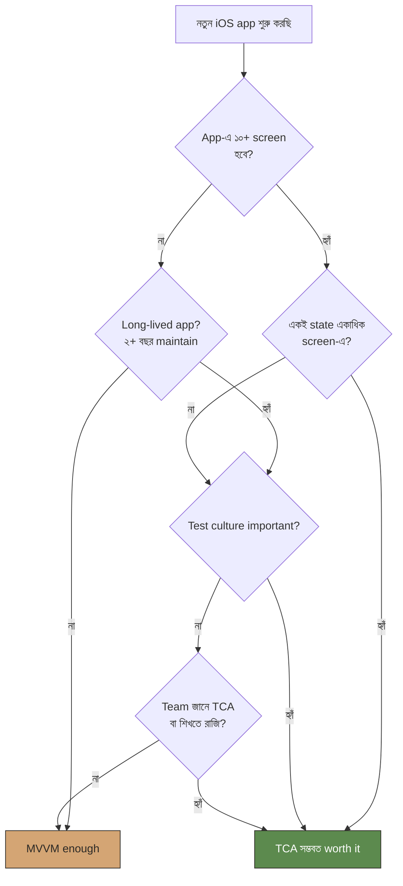

import Callout from '../../components/Callout.astro';
import TryIt from '../../components/TryIt.astro';

আগে যা শিখেছ — TCA সব দিক থেকে strict, organised, testable। প্রশ্ন আসে — *"তাহলে কি প্রতিটা app-এই TCA?"*

উত্তর: না। **TCA একটা tool**, panacea না। ভুল project-এ ব্যবহার করলে — boilerplate বেশি, productivity কম। এই অধ্যায়ে decide করা শিখবো — কখন আর কখন না।

## প্রথমে honest দিকটা

TCA-র দুটো খরচ আছে। এদেরকে কোথাও লেখা থাকে না, কিন্তু সবাই hadane —

### খরচ ১: Boilerplate

একটা ছোট counter — MVVM-এ ১০ লাইন। TCA-তে ৩০-৪০ লাইন। দশ-বিশটা small feature মিলে এই overhead ৩-৪ গুণ code।

### খরচ ২: Learning curve

Team-এ নতুন এক জন junior আসলে — সে SwiftUI জানে, MVVM জানে, কিন্তু TCA জানে না। তাকে শেখাতে হবে। শেখার আগে সে productive না।

এই দুই খরচ accept করার মতো **কখন**? যখন benefit এদেরকে justify করে। বেনিফিট কী কী —

## কখন TCA — ৬টা green flag

এই ৬টার মধ্যে ৩টা বা বেশি যদি match করে — TCA worth it।

### ১. App-এ ১০+ screen, complex navigation

দশ-বিশটা screen, কয়েকটা tabs, modal/sheet flow, deep links — এই scale-এ MVVM-এ state management নিজে hand-build করতে কষ্ট। TCA-র `@Presents`, `Destination` enum এই jungle সহজ করে দেয়।

### ২. একটা state বহু জায়গায় reflect হয়

Cart-এ একটা item যোগ — header badge update, profile-এ counter update, hometab-এ recommendation update — তিন জায়গায়।

MVVM-এ এটা handle করতে গেলে — singleton, Combine pub-sub, notification center, weird coupling। TCA-তে — `RootFeature` state এ cart আছে, sub-features সবাই scope করছে — natural আপডেট, কোনো extra plumbing না।

### ৩. Team large — multiple devs same codebase-এ

দু'জন parallel কাজ করলে — একজনের refactor অন্যজনের feature ভাঙবে? MVVM-এ frequent। TCA-তে strict structure-এর কারণে collision কম। `Scope` দিয়ে isolation।

### ৪. Testing important — health critical, finance, etc.

App-এ bug মানে money loss বা real harm? — comprehensive tests must। TCA-র TestStore-এ test লিখা ১০ গুণ সহজ। যদি তুমি serious test culture চাও — TCA।

### ৫. App long-lived — years of maintenance ahead

বছরের পর বছর maintain হবে? — code structure পরে আসা dev-এরা পড়তে পারবে কিনা — সেটা matter করে। TCA-র structure এতটাই consistent যে নতুন code-base joining অনেক fast।

### ৬. Multi-platform — iOS + macOS + watchOS share করতে হবে

TCA features platform-agnostic — same Reducer macOS-এ, watchOS-এ। শুধু View গুলো alada। MVVM-এও সম্ভব, কিন্তু TCA-তে discipline ready-made।

## কখন **না** TCA — ৬টা red flag

### ১. App ছোট — ৫-এর কম screen, ২-৩টা flows

Calculator। Tip jar। Timer। Quick prototype। এই scale-এ MVVM 2 ঘণ্টায় হবে — TCA-তে আগে ১ ঘণ্টা setup, তারপর actual feature। Don't bother।

### ২. Demo / proof of concept

দু'দিনের কাজ — client-কে দেখানোর জন্য — TCA setup খরচ recoup হবে না। SwiftUI + `@State` enough।

### ৩. Team-এ Swift Concurrency বা SwiftUI-ই নতুন

Team যদি এখনো `@StateObject`-এ comfortable না হয় — TCA add করলে দ্বিগুণ confusion। আগে fundamentals, তারপর TCA।

### ৪. App primarily declarative — fancy logic নেই

Mostly static content — news reader, magazine reader, simple browser। State minimal। TCA-র structure overkill।

### ৫. একদম strict deadline + small team

৩ সপ্তাহে ship করতে হবে, ২ জন dev, কেউ TCA জানে না — শিখতে শুরু না করাই ভালো। Project শেষ করে next time consider।

### ৬. কোনো Swift Package অলরেডি দিয়ে দিচ্ছে — তোমার শুধু skin

যদি app মূলত existing SDK / package-এর around এক pretty wrapper — তেমন state-ই নেই — TCA bring করার দরকার নেই।

## A decision tree

এক বাক্যে — যদি app ছোট না হয়, state cross-screen-এ থাকে, test critical, team ready — TCA। আর কোনো একটাও miss করলে — pause। পুনর্বিচার।

## "অর্ধেক TCA" — হয় কি?

হ্যাঁ, কিছু লোক এই hybrid pattern চালায় — *complex screens-এ TCA, simple screens-এ plain SwiftUI/MVVM*।

Pros — boilerplate কম যেখানে দরকার নেই।
Cons — code base inconsistent। নতুন dev-এর জন্য confusing। দু'টা mental model maintain করতে হবে।

আমার পরামর্শ — **পুরো app-এ একটাই pattern**। যদি TCA — সব TCA। যদি MVVM — সব MVVM। যদি একদমই hybrid করতে হয় — পুরো *feature*-কে hybrid না, পুরো *tab* বা *flow*-কে TCA।

## চা স্টলে যেমন

<Callout type="tea-stall">
ভাবো একটা ছোট রাস্তার চা-ওয়ালা — থার্মোসে চা ঢালে, পাঁচ টাকা নেয়, দিন শেষে গৃহে চলে যায়। ৩ কাপ বিক্রি হোক বা ৩০ কাপ — সে মাথায় হিসাব রাখে।

আর একটা বড় চা স্টল — ৩ টা table, ২ জন কর্মচারী, kettle দু'টা, milk-stock track রাখতে হয়, daily revenue হিসাব রাখতে হয়। এখানে বোর্ড লাগে। মামা লাগে। ছোট ভাই লাগে। structure লাগে।

ছোট চা-ওয়ালার দরকার নেই TCA-র mama-board-shyster setup। বড় স্টলের লাগবেই।
</Callout>

## আরো একটা সৎ কথা

কখনো কখনো TCA-তে গিয়েও তুমি ফিরে আসতে পারো। MVVM-এও ফিরে আসতে পারো। এটা ভুল না।

Project early-stage-এ — যখন requirement বদলাচ্ছে দ্রুত — MVVM-এ থেকে দ্রুত iterate করো। Product stable হলে, scope clear হলে — যদি দরকার পড়ে — TCA-তে move করো।

বা উল্টোটা — যদি দেখো TCA boilerplate maintain করে অর্ধেক বেশি সময় দিচ্ছ অসুবিধা পেয়ে — পিছিয়ে এসে MVVM-এ যাও। এটাও ভুল না।

**Tool serve করে you, you don't serve the tool**।

## নিজে চেষ্টা করো

<TryIt title="তোমার next project-এর জন্য decide কর">
এই decision tree-টা তোমার চলমান বা পরিকল্পিত একটা project-এর জন্য চালাও। ছ'টা green flag কতগুলো match করে? ছ'টা red flag কতগুলো? উত্তর কী?

আর তাও যদি ১০০% সিদ্ধান্ত না নিতে পারো — তাহলে একটা ছোট সিদ্ধান্ত: প্রথম দুটো screen prototype দু'রকম pattern-এ লিখো (TCA + MVVM)। যেটায় তুমি বেশি comfortable, যেটায় code পড়তে ভালো লাগছে — সেটায় চলো।
</TryIt>

## এই অধ্যায়ের সারমর্ম

<Callout type="remember">
- TCA-র দুটো খরচ — boilerplate আর learning curve।
- ৬ green flag মিললে worth it: scale, shared state, big team, testing, longevity, multi-platform।
- ৬ red flag-এর কোনোটা থাকলে pause: ছোট app, demo, team SwiftUI-ই নতুন, mostly declarative, strict deadline, thin SDK wrapper।
- Hybrid এড়াও — পুরো app একই pattern-এ।
- Tool serves you — উল্টোটা না।
</Callout>

পরের অধ্যায়ে — হাতে কলমে একটা real project। Todo app, পুরোটা TCA-তে।
