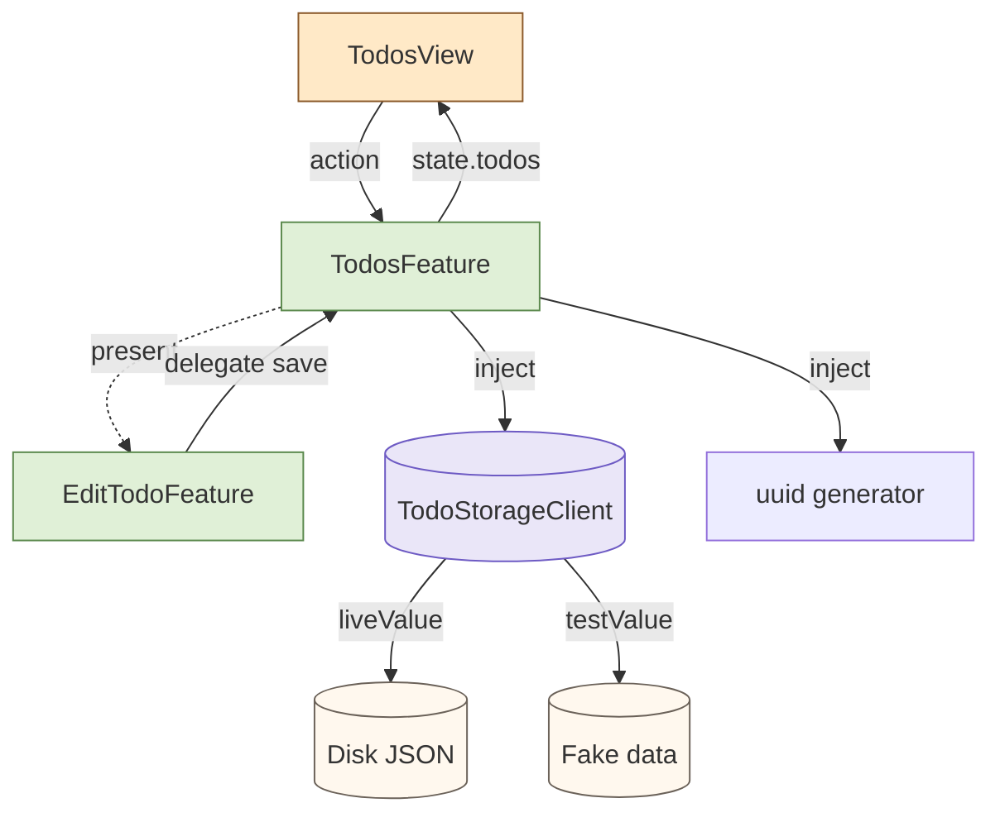

import Callout from '../../components/Callout.astro';
import TeaStallScene from '../../components/TeaStallScene.astro';
import TryIt from '../../components/TryIt.astro';

<Callout type="tip" title="কোথায় code লিখবে">
চলো `TCAPlayground/Chapter12_TodoApp/` folder-এ পাঁচটা file বানাই, `Todo.swift`, `TodoStorageClient.swift`, `TodosFeature.swift`, `EditTodoFeature.swift`, `TodosView.swift`। আর tests-এর জন্য `TCAPlaygroundTests/Chapter12_TodoAppTests/` folder-এ unit tests, এবং `TCAPlaygroundUITests/Chapter12_TodoUITests.swift` UI test-এর জন্য।
</Callout>

এতক্ষণ আমরা ছোট ছোট ৫-৬টা piece শিখেছি, counter, fact, composition, navigation, dependency, test। এই অধ্যায়ে সবগুলো একসাথে এক জায়গায়। একটা ছোট কিন্তু complete app।

## লক্ষ্য

একটা Todo manager:

- Todo যোগ, edit, delete।
- Mark as done।
- Filter: All / Active / Completed।
- App restart-এ data থেকে যায় (local storage)।
- Edit screen, sheet-এ।
- পুরোটার জন্য test।

এই scope ছোট কিন্তু realistic, তোমাদের actual project-এর pattern এর মতো।

## File structure, code + tests

```text
TCAPlayground/
└── Chapter12_TodoApp/
    ├── Todo.swift                      ← model
    ├── TodoStorageClient.swift         ← dependency
    ├── EditTodoFeature.swift           ← child reducer
    ├── TodosFeature.swift              ← parent reducer
    └── TodosView.swift                 ← view

TCAPlaygroundTests/
└── Chapter12_TodoAppTests/
    ├── TodosFeatureTests.swift         ← ৬টা unit test
    └── EditTodoFeatureTests.swift      ← ২টা unit test

TCAPlaygroundUITests/
└── Chapter12_TodoUITests.swift         ← end-to-end UI test
```

Code আর tests পাশাপাশি। কোনো feature change হলে, pair-এর test-ও update। কোনো bug ধরা পড়লে, failing test লিখে capture, তারপর fix।

## পুরো architecture এক ছবিতে



Parent (TodosFeature) → Child (EditTodoFeature) presentation। Dependency দু'টা, storage আর uuid। View শুধু parent-এর সাথে কথা বলে।

## ১. Model

```swift
// Todo.swift
import Foundation

struct Todo: Equatable, Identifiable, Codable {
    let id: UUID
    var title: String
    var isCompleted: Bool

    init(id: UUID, title: String, isCompleted: Bool = false) {
        self.id = id
        self.title = title
        self.isCompleted = isCompleted
    }
}
```

`Codable` কারণ persistence-এ JSON-এ লিখবো।

## ২. Storage client, dependency

```swift
// TodoStorageClient.swift
import ComposableArchitecture
import Foundation

struct TodoStorageClient {
    var load: @Sendable () async throws -> [Todo]
    var save: @Sendable ([Todo]) async throws -> Void
}

extension TodoStorageClient: DependencyKey {

    static let liveValue: TodoStorageClient = {
        let url = URL.documentsDirectory.appending(path: "todos.json")

        return TodoStorageClient(
            load: {
                guard FileManager.default.fileExists(atPath: url.path()) else { return [] }
                let data = try Data(contentsOf: url)
                return try JSONDecoder().decode([Todo].self, from: data)
            },
            save: { todos in
                let data = try JSONEncoder().encode(todos)
                try data.write(to: url, options: .atomic)
            }
        )
    }()

    static let previewValue = TodoStorageClient(
        load: {
            [
                Todo(id: UUID(), title: "চা বানাও"),
                Todo(id: UUID(), title: "দোকানে যাও", isCompleted: true),
            ]
        },
        save: { _ in }
    )

    static let testValue = TodoStorageClient(
        load: unimplemented("TodoStorageClient.load"),
        save: unimplemented("TodoStorageClient.save")
    )
}

extension DependencyValues {
    var todoStorage: TodoStorageClient {
        get { self[TodoStorageClient.self] }
        set { self[TodoStorageClient.self] = newValue }
    }
}
```

দেখো, `liveValue`-এ আসল file save, `previewValue`-এ kitchen-sink data, `testValue` unimplemented।

## ৩. EditTodoFeature

আগের navigation chapter-এর pattern পুনর্ব্যবহার।

```swift
// EditTodoFeature.swift
import ComposableArchitecture

@Reducer
struct EditTodoFeature {
    @ObservableState
    struct State: Equatable {
        var todo: Todo
    }

    enum Action: BindableAction {
        case binding(BindingAction<State>)
        case saveTapped
        case cancelTapped
        case delegate(Delegate)
        enum Delegate: Equatable {
            case save(Todo)
            case cancel
        }
    }

    var body: some ReducerOf<Self> {
        BindingReducer()
        Reduce { state, action in
            switch action {
            case .binding: return .none
            case .saveTapped:
                let trimmed = state.todo.title.trimmingCharacters(in: .whitespaces)
                guard !trimmed.isEmpty else { return .none }
                state.todo.title = trimmed
                return .send(.delegate(.save(state.todo)))
            case .cancelTapped:
                return .send(.delegate(.cancel))
            case .delegate:
                return .none
            }
        }
    }
}
```

## ৪. TodosFeature, main reducer

```swift
// TodosFeature.swift
import ComposableArchitecture
import Foundation

@Reducer
struct TodosFeature {

    enum Filter: String, CaseIterable, Equatable {
        case all = "সব"
        case active = "চলমান"
        case completed = "শেষ"
    }

    @ObservableState
    struct State: Equatable {
        var todos: [Todo] = []
        var filter: Filter = .all
        var draft: String = ""
        @Presents var editTodo: EditTodoFeature.State?

        var filteredTodos: [Todo] {
            switch filter {
            case .all:       return todos
            case .active:    return todos.filter { !$0.isCompleted }
            case .completed: return todos.filter { $0.isCompleted }
            }
        }
    }

    enum Action: BindableAction {
        case binding(BindingAction<State>)
        case onAppear
        case loadResponse([Todo])
        case addTapped
        case toggleCompleted(Todo.ID)
        case deleteTodo(IndexSet)      // filteredTodos-এর index।
        case editTapped(Todo.ID)
        case editTodo(PresentationAction<EditTodoFeature.Action>)
        case persistFinished                 // save complete signal।
    }

    @Dependency(\.todoStorage) var storage
    @Dependency(\.uuid) var uuid

    var body: some ReducerOf<Self> {
        BindingReducer()
        Reduce { state, action in
            switch action {

            case .binding:
                return .none

            case .onAppear:
                return .run { send in
                    let saved = (try? await storage.load()) ?? []
                    await send(.loadResponse(saved))
                }

            case let .loadResponse(saved):
                state.todos = saved
                return .none

            case .addTapped:
                let trimmed = state.draft.trimmingCharacters(in: .whitespaces)
                guard !trimmed.isEmpty else { return .none }
                state.todos.insert(
                    Todo(id: uuid(), title: trimmed),
                    at: 0
                )
                state.draft = ""
                return persist(state.todos)

            case let .toggleCompleted(id):
                if let idx = state.todos.firstIndex(where: { $0.id == id }) {
                    state.todos[idx].isCompleted.toggle()
                }
                return persist(state.todos)

            case let .deleteTodo(offsets):
                // Filter অনুযায়ী index, actual todo লিস্টে মিলিয়ে delete।
                let toRemove = offsets.map { state.filteredTodos[$0].id }
                state.todos.removeAll { toRemove.contains($0.id) }
                return persist(state.todos)

            case let .editTapped(id):
                if let todo = state.todos.first(where: { $0.id == id }) {
                    state.editTodo = EditTodoFeature.State(todo: todo)
                }
                return .none

            case let .editTodo(.presented(.delegate(.save(updated)))):
                if let idx = state.todos.firstIndex(where: { $0.id == updated.id }) {
                    state.todos[idx] = updated
                }
                state.editTodo = nil
                return persist(state.todos)

            case .editTodo(.presented(.delegate(.cancel))),
                 .editTodo(.dismiss):
                state.editTodo = nil
                return .none

            case .editTodo:
                return .none

            case .persistFinished:
                return .none
            }
        }
        .ifLet(\.$editTodo, action: \.editTodo) {
            EditTodoFeature()
        }
    }

    private func persist(_ todos: [Todo]) -> Effect<Action> {
        .run { send in
            try await storage.save(todos)
            await send(.persistFinished)
        }
    }
}
```

কোডটা বড় ঠিকই, কিন্তু একই pattern বার বার, `case ...: state বদল; effect return`। কোনো new construct নেই, শুধু আগের সবগুলো একসাথে।

## ৫. View

```swift
// TodosView.swift
import SwiftUI
import ComposableArchitecture

struct TodosView: View {
    @Bindable var store: StoreOf<TodosFeature>

    var body: some View {
        NavigationStack {
            VStack(spacing: 0) {
                Picker("Filter", selection: $store.filter) {
                    ForEach(TodosFeature.Filter.allCases, id: \.self) { f in
                        Text(f.rawValue).tag(f)
                    }
                }
                .pickerStyle(.segmented)
                .padding()

                List {
                    Section {
                        HStack {
                            TextField("নতুন কাজ লিখো…", text: $store.draft)
                                .accessibilityIdentifier("todo-draft")
                            Button("যোগ") { store.send(.addTapped) }
                                .buttonStyle(.borderedProminent)
                                .disabled(store.draft.trimmingCharacters(in: .whitespaces).isEmpty)
                                .accessibilityIdentifier("todo-add")
                        }
                    }

                    Section {
                        ForEach(store.filteredTodos) { todo in
                            HStack {
                                Button {
                                    store.send(.toggleCompleted(todo.id))
                                } label: {
                                    Image(systemName: todo.isCompleted ? "checkmark.circle.fill" : "circle")
                                        .foregroundStyle(todo.isCompleted ? Color.green : Color.secondary)
                                }
                                .buttonStyle(.plain)
                                .accessibilityIdentifier("todo-toggle-\(todo.id.uuidString)")

                                Text(todo.title)
                                    .strikethrough(todo.isCompleted)
                                    .foregroundStyle(todo.isCompleted ? .secondary : .primary)

                                Spacer()
                            }
                            .contentShape(Rectangle())
                            .onTapGesture {
                                store.send(.editTapped(todo.id))
                            }
                        }
                        .onDelete { offsets in
                            store.send(.deleteTodo(offsets))
                        }
                    }
                }
                .listStyle(.insetGrouped)
            }
            .navigationTitle("আজকের কাজ")
            .onAppear { store.send(.onAppear) }
            .sheet(item: $store.scope(state: \.editTodo, action: \.editTodo)) { editStore in
                NavigationStack {
                    EditTodoView(store: editStore)
                }
            }
        }
    }
}

struct EditTodoView: View {
    @Bindable var store: StoreOf<EditTodoFeature>

    var body: some View {
        Form {
            TextField("কাজের নাম", text: $store.todo.title)
            Toggle("শেষ হয়েছে", isOn: $store.todo.isCompleted)
        }
        .navigationTitle("Edit")
        .toolbar {
            ToolbarItem(placement: .cancellationAction) {
                Button("বাতিল") { store.send(.cancelTapped) }
            }
            ToolbarItem(placement: .confirmationAction) {
                Button("সেভ") { store.send(.saveTapped) }
            }
        }
    }
}
```

কোডটা boring-ই, কিন্তু সেটা ভালো কথা। Pattern repeat হচ্ছে।

## ৬. App entry

```swift
NavigationLink("১২, Todo app") {
    TodosView(
        store: Store(initialState: TodosFeature.State()) {
            TodosFeature()
        }
    )
}
.accessibilityIdentifier("nav-chapter-12")
```

Run করো, কাজ যোগ করো, mark করো, edit করো, delete করো। App restart করেও দেখো, list ফিরে আসে।

## ৭. Tests folder, ৬+ unit tests, প্রতিটা পথ cover

দু'টা feature, ৬টা unit test, ১টা UI test। চলো:

### TodosFeatureTests, মূল list-এর সব behavior

```swift
// TCAPlaygroundTests/Chapter12_TodoAppTests/TodosFeatureTests.swift
import ComposableArchitecture
import Testing
import Foundation
@testable import TCAPlayground

@MainActor
struct TodosFeatureTests {

    // ১. নতুন todo top-এ insert।
    @Test
    func addTodo_top_এ_insert_হয়() async {
        let store = TestStore(initialState: TodosFeature.State(draft: "চা বানাও")) {
            TodosFeature()
        } withDependencies: {
            $0.uuid = .incrementing
            $0.todoStorage.save = { _ in }
        }

        await store.send(.addTapped) {
            $0.todos = [
                Todo(id: UUID(0), title: "চা বানাও", isCompleted: false)
            ]
            $0.draft = ""
        }
        await store.receive(\.persistFinished)
    }

    // ২. খালি draft → কিছুই হবে না।
    @Test
    func empty_draft_কোনো_কাজ_যোগ_হয়_না() async {
        let store = TestStore(initialState: TodosFeature.State(draft: "   ")) {
            TodosFeature()
        }
        // কোনো state change নেই, block ছাড়াই send।
        await store.send(.addTapped)
    }

    // ৩. Toggle completion।
    @Test
    func toggle_completion_বদলায়() async {
        let id = UUID()
        let store = TestStore(
            initialState: TodosFeature.State(
                todos: [Todo(id: id, title: "test", isCompleted: false)]
            )
        ) {
            TodosFeature()
        } withDependencies: {
            $0.todoStorage.save = { _ in }
        }

        await store.send(.toggleCompleted(id)) {
            $0.todos[0].isCompleted = true
        }
        await store.receive(\.persistFinished)
    }

    // ৪. Filter switching।
    @Test
    func filter_active_শুধু_pending_দেখায়() async {
        let done = Todo(id: UUID(), title: "done", isCompleted: true)
        let pending = Todo(id: UUID(), title: "pending", isCompleted: false)

        let store = TestStore(
            initialState: TodosFeature.State(todos: [done, pending], filter: .all)
        ) {
            TodosFeature()
        }

        await store.send(.binding(.set(\.filter, .active))) {
            $0.filter = .active
        }
        // filteredTodos computed, assert না করেও pending-ই দেখাবে।
        #expect(store.state.filteredTodos == [pending])
    }

    // ৫. Load on appear।
    @Test
    func onAppear_save_করা_data_load_করে() async {
        let sample = [Todo(id: UUID(), title: "saved")]
        let store = TestStore(initialState: TodosFeature.State()) {
            TodosFeature()
        } withDependencies: {
            $0.todoStorage.load = { sample }
        }

        await store.send(.onAppear)
        await store.receive(\.loadResponse) {
            $0.todos = sample
        }
    }

    // ৬. Edit screen open।
    @Test
    func tap_on_todo_edit_screen_খোলে() async {
        let todo = Todo(id: UUID(), title: "edit me")
        let store = TestStore(initialState: TodosFeature.State(todos: [todo])) {
            TodosFeature()
        }

        await store.send(.editTapped(todo.id)) {
            $0.editTodo = EditTodoFeature.State(todo: todo)
        }
    }
}
```

### EditTodoFeatureTests, child reducer-এর tests

```swift
// TCAPlaygroundTests/Chapter12_TodoAppTests/EditTodoFeatureTests.swift
import ComposableArchitecture
import Testing
import Foundation
@testable import TCAPlayground

@MainActor
struct EditTodoFeatureTests {

    // ১. Save → delegate fire।
    @Test
    func save_action_delegate_পাঠায়() async {
        let todo = Todo(id: UUID(), title: "draft")
        let store = TestStore(
            initialState: EditTodoFeature.State(todo: todo)
        ) {
            EditTodoFeature()
        }

        // Title edit।
        await store.send(.binding(.set(\.todo.title, "updated"))) {
            $0.todo.title = "updated"
        }
        await store.send(.saveTapped)
        await store.receive(\.delegate) // .save(updated todo)
    }

    // ২. Cancel → delegate fire।
    @Test
    func cancel_delegate_পাঠায়() async {
        let store = TestStore(
            initialState: EditTodoFeature.State(
                todo: Todo(id: UUID(), title: "x")
            )
        ) {
            EditTodoFeature()
        }

        await store.send(.cancelTapped)
        await store.receive(\.delegate)  // .cancel
    }
}
```

### UI Test, পুরো user flow

```swift
// TCAPlaygroundUITests/Chapter12_TodoUITests.swift
import XCTest

final class Chapter12_TodoUITests: XCTestCase {

    func test_add_toggle_filter_end_to_end_flow() {
        let app = XCUIApplication()
        app.launchArguments.append("--ui-testing")   // fresh state।
        app.launch()

        // ১. Chapter 12 navigation।
        app.buttons["nav-chapter-12"].tap()

        // ২. কাজ যোগ।
        let draft = app.textFields["todo-draft"]
        draft.tap()
        draft.typeText("চা বানাও")
        app.buttons["todo-add"].tap()

        // ৩. List-এ এসেছে কি?
        XCTAssertTrue(app.staticTexts["চা বানাও"].exists)

        // ৪. আরেকটা কাজ।
        draft.tap()
        draft.typeText("দোকানে যাও")
        app.buttons["todo-add"].tap()

        XCTAssertEqual(app.staticTexts.matching(identifier: "todo-title").count, 2)
    }
}
```

<Callout type="tip" title="UI test fresh state-এ চালানো">
`--ui-testing` launch argument check করে app initial state load করো, আগের run-এর data delete করে দাও। তাহলে test repeatable, deterministic।
</Callout>

### ⌘U চাপো

Xcode-এ ⌘U। Test navigator-এ green diamond দেখবে, সব test pass। ৬+ unit, ১ UI।

<Callout type="checkpoint">
দু'টা feature, ৮টা test (৬ unit + ২ feature child + ১ UI)। সব green। তোমার Todo app এখন real-world ready।
</Callout>

## Debugging story, যা bug ছিল, যেভাবে ধরলাম

এই app বানানোর সময় একটা bug ছিল, Chapter ১০-এর **Case ২** ("Effect কখনো fire-ই করছে না")-এর ঠিক copy।

প্রথম draft-এ আমি লিখেছিলাম:

```swift
case .addTapped:
    let trimmed = state.draft.trimmingCharacters(in: .whitespaces)
    guard !trimmed.isEmpty else { return .none }
    state.todos.insert(Todo(id: uuid(), title: trimmed), at: 0)
    state.draft = ""
    persist(state.todos)         // ❌ return-ই করিনি!
    return .none
```

App চলছিল, todo list-এ যোগ হচ্ছিল। কিন্তু restart করলে গাঁয়েব। **Persistence কাজ করছে না।** কোথায় bug?

### Step 1: Reproduce

App run → "চা বানাও" → Add → App quit → App relaunch → list খালি। Reliably reproduce।

### Step 2: Failing test লিখলাম

```swift
@Test
func addTapped_persist_call_করে() async {
    var savedTodos: [Todo] = []
    let store = TestStore(initialState: TodosFeature.State(draft: "x")) {
        TodosFeature()
    } withDependencies: {
        $0.uuid = .incrementing
        $0.todoStorage.save = { todos in savedTodos = todos }
    }

    await store.send(.addTapped) { /* ... */ }
    await store.receive(\.persistFinished)
    #expect(savedTodos.count == 1)
}
```

Test fail করল, `persistFinished` action received-ই হচ্ছে না। মানে persist effect শুরুই হয়নি।

### Step 3: Suspect, Effect, না Reducer?

`_printChanges()` add করে দেখলাম:

```
received action:
  TodosFeature.Action.addTapped
TodosFeature.State(
- draft: "x",
+ draft: "",
  todos: [Todo(id: ..., title: "x", ...)],
  ...
)
```

State বদলেছে। কিন্তু persistFinished action আর আসছে না। মানে, `.run { ... }` effect-টা schedule-ই হয়নি।

### Step 4: Reducer-এর ভেতরে breakpoint

`addTapped` case-এ breakpoint। Pause হলে দেখলাম, `persist(state.todos)` call হচ্ছে ঠিকই, return value কোথাও যাচ্ছে না। Statement-form, expression না।

### Step 5: Fix + regression test

```swift
case .addTapped:
    let trimmed = state.draft.trimmingCharacters(in: .whitespaces)
    guard !trimmed.isEmpty else { return .none }
    state.todos.insert(Todo(id: uuid(), title: trimmed), at: 0)
    state.draft = ""
    return persist(state.todos)        // ✓ return!
```

Test green। App-restart-এ list ফিরে আসে।

<Callout type="mystery">
এই bug Chapter ১০-এর Case ২-এর textbook example। বাস্তবে এটাই সবচেয়ে frequent TCA bug, *"একটা return ভুলে গেছি।"* Compiler help করে না, কারণ Swift-এ unused expression valid (warning দিতে পারে, কিন্তু error না)। `_printChanges()` আর failing test-ই বাঁচাল।
</Callout>

দেখলে, test না থাকলে production-এ যেত। User restart করত, data লুপ্ত, ১★ review দিত। Test থাকায় ১৫ মিনিটে ধরা পড়ল।

## চা স্টলে যেমন

<Callout type="tea-stall">
এই Todo app-এর state, বোর্ড। মামার চারটা কাজ, কাস্টমারের `addTapped` (নতুন অর্ডার যোগ), `toggleCompleted` (এক অর্ডার "ready" mark করা), `deleteTodo` (cancel)। আর ছোট ভাই (`storage`), মামা প্রতিবার বোর্ড update হলে তাকে বলে *"করিম, পেছনের diary-তে লিখে রাখ।"*। App restart হলে মামা বলে *"করিম, diary-টা নিয়ে আয়, দেখি কী লেখা ছিল।"*।

প্রতিটা TCA app আসলে এই চা স্টলের একটা variant। যত বড় app-ই হোক, পাঁচ বন্ধুর role একই।
</Callout>

## যা শিখলে এই project থেকে

- বড় feature-এ pattern repeat হয়, boilerplate, কিন্তু predictable।
- Persistence-ও একটা dependency, কোনো special concept না।
- Edit screen sheet-এ, `@Presents` + `Destination` pattern।
- Filter computed property হিসেবে, কোনো extra state নয়, derive করা।
- Test লেখা easy যখন dependency override-যোগ্য।

## নিজে চেষ্টা করো

<TryIt title="তিনটা বাড়তি feature">
১। **Today's count**: একটা প্রাপ্ত summary view, "তোমার আজকের কাজ: ৮টা, শেষ: ৫টা, বাকি: ৩টা"। Computed property।

২। **Search**: filter-এর পাশে একটা search field, যা title-এ search করবে। `state.search` add করো, `filteredTodos`-এ apply।

৩। **Reordering**: List-এ drag দিয়ে reorder। `.onMove`-এ একটা action পাঠাও।

প্রতিটা পরিবর্তন ৫-১০ লাইনের বেশি না, যদি বেশি লাগে, pattern থেকে সরে এসেছ।
</TryIt>

## এই অধ্যায়ের সারমর্ম

<Callout type="remember">
- বড় feature মানে নতুন concept নয়, পুরনো pattern-এর repeat।
- Persistence একটা dependency-এর মতোই, `load`/`save` closures।
- Computed properties (`filteredTodos`) দিয়ে derived state, দু'বার store করো না।
- Sheet edit + delegate communication = clean parent-child।
- প্রতিটা mutation-এর জন্য one test = full coverage শীঘ্র।
- UI test critical user flows-এর জন্য, accessibility identifiers দিয়ে।
- বাস্তব debugging-এ `_printChanges` + failing test = ৯০% bug ১৫ মিনিটে।
</Callout>

<Callout type="level-up">
🎉 **Level Up!** তুমি এইমাত্র একটা full TCA app বানালে, features, persistence, navigation, tests, UI test, এমনকি একটা real debugging story। চা ঠান্ডা না হওয়ার আগে শেষ quest-এ যাও।
</Callout>
